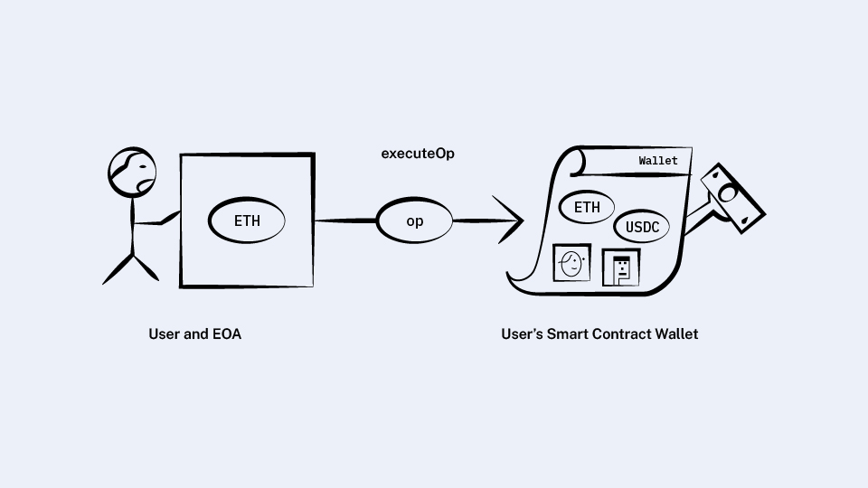
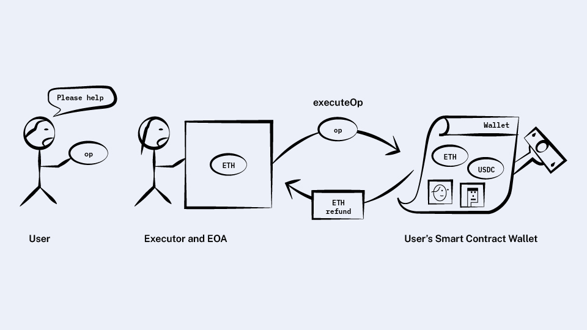
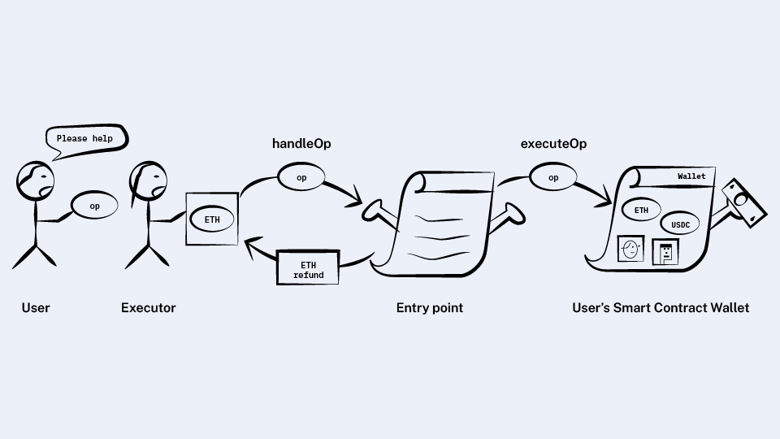
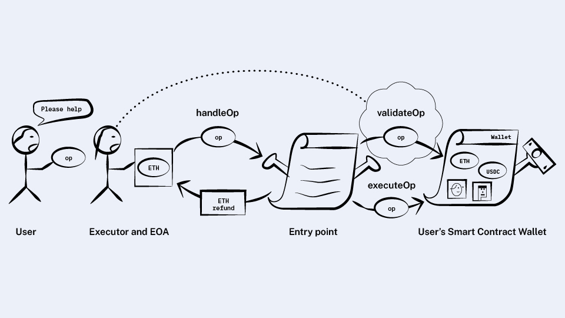
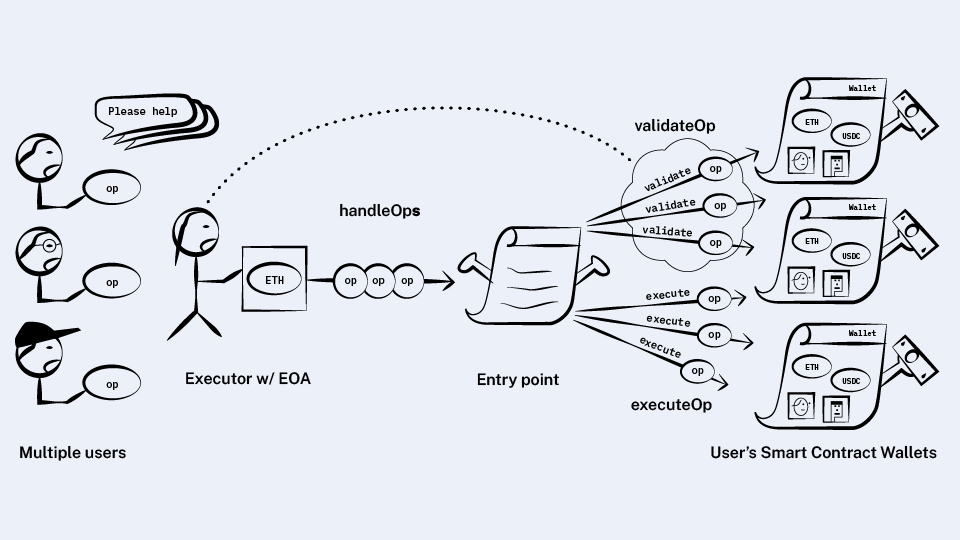

*원문: https://www.alchemy.com/blog/account-abstraction*

## How simple choices lead down the complex path to ERC-4337
**단순한 방식이 결국 복잡한 과정을 거쳐서 ERC-4337에 이르게 되기까지**

계정 추상화는 블록체인과 연결하는 방식을 완전히 바꾸게 될 것입니다. 하지만 [ERC-4337](https://github.com/ethereum/EIPs/blob/master/EIPS/eip-4337.md)에서 제안된 계정 추상화의 표준은 읽기가 
쉽지 않고, 왜 그렇게 많은 참여자들이 필요한지, 왜 그런 식으로 연계되는지 이해하기 힘들 것입니다.

좀 더 간단하게 할 수 없을까요?

이 글에서는 계정 추상화를 매우 단순하게 설계해보려고 합니다. 그리고 그 과정에서 발생하는 문제점들을 해결하고 더 많은 요구사항들을 추가시키고, 그래서 더 복잡해지고, 마침내 ERC-4337에 점점 가까워지는 것을 보게 될 것입니다.

이 글은 스마트 컨트랙트에 대한 지식은 있지만 계정 추상화에 대해서는 특별히 아는 것이 없는 사람들을 위해 작성되었습니다.

이 문서는 계정 추상화를 구현해가는 과정을 살펴보려고 하기 때문에 최종 버전인 ERC-4337과 일치하지 않는 API와 내용들이 있을 수 있습니다.
예를 들면, `User Operation`에 들어가는 항목들을 나열할 때 이것이 실제 표준의 항목들이라고 생각하지 마십시오. 그것은 `User Operation`을 정의하면서 
최종 버전을 완성하기 전에 처음에 그냥 넣어보는 항목일 수 있습니다.

이제 시작해보겠습니다.

### Goal: Create a wallet that protects our assets 
처음 시작은 귀중한 자산을 보호하는 방법을 고안하는 것입니다.
사람들은 보통 단일한 개인키(지금의 계정처럼)로 트랜잭션을 서명하기를 원합니다. 하지만 고가의 ["Carbonated Courage NFT"](https://carbonatedcourage.org/) 같은 것은
머리가 셋 달린 개(역주: 그리스 신화에 나오는 지하 세계를 지킨다는 개)가 지키는 금고 안에 보관된 두 번째 키까지 서명을 해야 
전송할 수 있어야 할 것 같습니다.

여기서 첫번째 질문이 나옵니다:
모든 이더리움 계정은 스마트 컨트랙트 계정 또는 EOA 계정입니다. 후자는 오프체인에서 개인키를 사용하여 만들어지고 관리됩니다. 자산을 보관하는 계정은
스마트 컨트랙트가 되어야 할까요, 아니면 EOA 계정이 되어야 할까요?

사실 자산을 보관하는 곳은 스마트 컨트랙트이어야 합니다. 만약 EOA가 자산을 가지고 있다면 그것은 언제든지 EOA의 개인키로 서명하기만
하면 전송될 수 있습니다.

현재 사람들의 생각과는 달리, (자산은) EOA가 아니라 스마트 컨트랙트에 의해 온체인 상에 있어야 하고 우리는 그것을 스마트 컨트랙트 지갑,
또는 그냥 "지갑(wallet)"이라고 하겠습니다.

그런데 우리가 원하는 기능을 수행할 수 있도록 스마트 컨트랙트에 명령을 내리는 방법이 필요합니다. EOA에서 했던 것처럼
전송이나 컨트랙트 호출을 할 수 있는 방법들이 필요할 것입니다.

### User operations  
자산을 보관할 지갑 컨트랙트를 배포해보겠습니다. 이 컨트랙트는 내가 원하는 기능을 수행할 수 있는 하나의 메소드만 가지고 있습니다.
내 지갑에게 어떤 기능을 수행하도록 하는 액션을 나타내는 데이터를 `user operation` 또는 `user op` 이라고 하겠습니다(역주: 앞으로 "사용자 요청" 또는 "요청"이라고 하겠습니다).  
지갑 컨트랙트는 아래와 같습니다.

```solidity
contract Wallet {
  function executeOp(UserOperation op);
}
```

`user operation`에는 어떤 것들이 들어가야 할까요? 우선 `eth_sendTransaction`에 전달되어야 하는 모든 파라미터들이 필요합니다:

```solidity
struct UserOperation {
  address to;
  bytes data;
  uint256 value; // Amount of wei sent
  uint256 gas;
  // ...
}
```
여기에 (추가적으로) 이 요청을 허가할 수 있는 어떤 정보를 제공할 필요가 있습니다. 즉 지갑이 이 작업을 수행할지 여부를 결정할 수 있도록
해주는 데이터가 필요합니다.

NFT를 보관하는 지갑에서, 대부분의 요청들은 메인 키로 서명한 전자서명을 전달하면 됩니다. 하지만 이 `user op`가 Carbonated Courage NFT를
전송하는 요청이라면 두 개의 키로 요청 데이터를 서명한 전자서명이 필요할 것입니다.

또 이전에 보낸 `user op`를 다시 보내는 리플레이 공격을 막기 위해 nonce를 보내야 합니다.

```solidity
struct UserOperation {
    // ...
    bytes signature;
    uint256 nonce;
}
```

이렇게 하면 처음 세운 목표를 달성했습니다!  
이 컨트랙트가 내 Carbonated Courage NFT를 가지고 있는 한, 두 개의 키로 서명된 전자서명이 없으면 절대로 다른 사람에게 전송될 수 없을 것입니다.  

### Who calls the smart contract wallet?

여기서 그냥 넘어간 부분은 `executeOp(op)`를 호출하는 방법입니다. 내 개인키들 없이는 동작하지 않기 때문에 누가 그것을 호출하든 보안상 위험은 없을 것입니다. 하지만 그것을 실행해줄 누군가가 필요합니다.

이더리움에서는 모든 트랜잭션들이 EOA로부터 시작됩니다. 그리고 EOA는 가스비를 이더로 지불해야 합니다. 그렇게 하려면 
이 지갑 컨트랙트를 호출하는 용도로만 사용하는 별도의 EOA 계정이 필요할 것 같습니다. 이 계정은 두 개의 키를 가질 필요는 없습니다. 가스비 정도만 지불할 수 있는 
이더만 보유하게 하고, 반면에 귀중한 자산은 안전한 지갑 컨트랙트가 가지도록 하는 것입니다. 

간단한 컨트랙트만으로 계정 추상화를 구현한 것입니다! Not bad!



### Goal: No separate EOA

위 방법의 단점은 지갑을 호출하기 위해 별도의 EOA 계정을 하나 더 가지고 있어야 한다는 것입니다. 만약 그렇게 하고 싶지 않다면 어떻게 해야 할까요? 내가 가스비를 이더로 지불하는 것은 
맞지만 두 개의 계정을 가지고 싶지는 않다면 말입니다.

앞에서 지갑 컨트랙트의 `executeOp` 메소드는 누구나 실행할 수 있을 것이라고 말했습니다. 그러니까 EOA 계정을 가진 누군가에게 
부탁할 수도 있을 것입니다. 이런 역할을 하는 사람들을 "실행자"라고 부르겠습니다. 

실행자는 가스비를 내야 하기 때문에 대부분 공짜로 그것을 해주는 사람들은 없을 것입니다. 그래서 지갑 컨트랙트가 
약간의 이더를 가지도록 하고 실행자가 지갑을 호출하면 일정 금액의 이더를 실행자에게 보상해주도록 하는 것입니다.

>💡"실행자(executor)”는 ERC-4337 에 나오는 용어는 아닙니다. 하지만 이런 역할을 수행하는 참여자를 잘 설명하는 용어입니다. 
후에 이것을 ERC-4337에서 실제 사용되는 “bundler”라는 단어로 대체할 것입니다. 지금 단계에서는 "번들링"을 하지는 않기 때문에 그렇게 부르지는 않겠습니다. 다른 프로토콜에서는 이들을 “relayer”라고 하기도 합니다.

### First attempt: The wallet refunds the executor at the end
단순하게 시작해보겠습니다. 지갑의 인터페이스는 아래와 같았습니다:

```solidity
contract Wallet {
  function executeOp(UserOperation op);
}
```
`executeOp`를 수정합니다. 마지막 단계에서 어느 정도의 가스가 소모되었는지 계산하고 그에 맞는 금액의 이더를 실행자에게 되돌려주는 겁니다.  



#### First brush with simulation
시뮬레이션해보기

(실행자들이) 내 지갑 컨트랙트를 믿는다면 이런 방식은 잘 동작할 것입니다! 하지만 실행자들이 내 지갑이 가스비를 되돌려줄 것이라는 
확신이 있어야 합니다. 만약 `executeOp`를 호출했는데 실제 가스비를 되돌려받지 못하면 실행자가 모든 비용을 내는 셈이 됩니다.

이러한 시나리오를 피하기 위해서는 `executeOp`를 로컬에서, 마치 `debug_traceCall`처럼 한번 시뮬레이션 해볼 필요가 있고 실제 가스비를 
보전받을 수 있는지 확인하는 것입니다. 그 후에 진짜 트랜잭션을 보내면 됩니다. 

여기서 문제는 실제에도 시뮬레이션처럼 동작할 것이라는 보장을 완전하게 할 수 없다는 점입니다. 시뮬레이션에서 
지갑이 가스비를 되돌려주었다고 해도, 트랜잭션이 블록에 실제 저장되는 시점에는 실패할 수 있습니다. 나쁜 지갑은 
의도적으로 그렇게 할 수 있고, 트랜잭션을 공짜로 실행하고 막대한 가스비를 실행자에게 물릴 수 있습니다.

#### Simulation could differ from real execution for a couple of reasons:
시뮬레이션은 몇 가지 이유로 실제 트랜잭션과 차이가 날 수 있습니다: 

* 스토리지에서 값을 읽고 변경할 때 시뮬레이션 시점과 실제 트랜잭션이 발생하는 시점이 다릅니다. 
* `TIMESTAMP`, `BLOCKHASH`, `BASEFEE` 같은 opcode들이 사용되는 경우 블록마다 값이 다릅니다. 

실행자가 취할 수 있는 한가지 방법은 이러한 동작을 제한하는 것입니다. 그러니까 "환경"과 관련된 opcode들을 사용하면 그것을 거부하는 것입니다.
하지만 이렇게 되면 너무 제한이 많아지게 됩니다.

지갑은 EOA처럼 모든 것을 실행할 수 있어야 합니다. 그래서 이러한 opcode들을 제한하는 것은 정당한 사용까지 막는 것입니다. 예를 들어, 이런 제한을 두면
`TIMESTAMP`를 많이 사용하는 유니스왑과 연결할 수 없게 됩니다.

지갑의 `executeOp`는 임의의 코드를 포함할 수 있기 때문에 시뮬레이션의 부정확함을 막기 위해 제약을 두는 것은 합리적이지 않습니다. 이 문제는 현재 인터페이스만으로
대처하기 어렵습니다. `executeOp`는 블랙박스처럼 보입니다.

#### Better attempt: Introducing the entry point

문제는 신뢰할 수 없는 컨트랙트의 코드를 실행자에게 실행해줄 것을 요청한다는 데서 비롯됩니다.
실행자는 어떤 확실한 보장을 받기를 원합니다. 이것이 바로 스마트 컨트랙트가 필요한 이유이기도 한데, 새로운 신뢰 컨트랙트(즉 감사를 받고, 소스코드가 공개된)를
도입하는 것입니다. 이것을 `entry point` 라고 하고 다음과 같은 메소드를 실행자에게 제공하는 것입니다:

```solidity
contract EntryPoint {
  function handleOp(UserOperation op);

  // ...
}
```

`handleOp`은 다음과 같은 일을 수행합니다:

* 지갑이 최대 가스에 대해 비용을 지불할 여력이 있는지 확인(`user op`에 있는 `gas` 항목에 기반). 만약 그렇지 못하다면 거부.  

* 지갑의 `executeOp` 메소드 호출(적절한 가스로), 그리고 실제 사용되는 가스를 추적

* 실행자에게 가스비에 상응하는 지갑의 이더를 전송

세번째 항목의 작업을 수행하려면 이제는 지갑이 아니라 `entry point`가 이더를 가지고 있어야 합니다. 왜냐하면 앞서 본 것처럼
지갑 컨트랙트로부터 이더를 인출할 수 있을 것이라는 보장을 완전히 할 수 없기 때문입니다.

따라서 `entry point`는 지갑으로부터(또는 지갑을 대신한 다른 사람에게서) 가스비에 해당하는 이더를 받을 수 있는 메소드가 필요하고, 또 원하는 경우
지갑이 다시 그것을 되찾을 수 있는 메소드도 필요합니다:

```solidity
contract EntryPoint {
  // ...

  function deposit(address wallet) payable;
  function withdrawTo(address payable destination);
}
```
이러한 구현을 통해 실행자는 어떤 경우라도 가스비를 되돌려 받을 수 있게 됩니다.



이것은 실행자에게 확실히 좋은 결과입니다. 하지만 지갑에게 다른 큰 문제가 생기게 됩니다.

>💡지갑이 `entry point`에 이더를 예치하는 것이 아니라 직접 가스비를 낼 수 있어야 하지 않을까요? 예 그렇게 해야죠! 하지만 다음 섹션의
변경 사항을 적용하기 전까지는 그렇게 할 수 없고 또 여전히 예치/인출 기능은 필요합니다. 또 대납(paymaster) 기능을 지원하기 위해서라도 필요하게 됩니다. 

### Splitting validation and execution

현재 지갑의 인터페이스는 아래와 같습니다.

```solidity
contract Wallet {
  function executeOp(UserOperation op);
}
```
이 메소드는 두 가지 일을 수행합니다: `user op`의 유효성을 검사하는 일, 그리고 요청을 실행하는 일입니다. 그런데 지갑의 소유자가 직접 가스비를 
내는 경우라면 둘을 구분할 필요는 없지만 실행자에게 실행을 요청하는 경우에는 중요한 차이가 있습니다.

지금까지 구현은 어떤 경우라도 지갑이 실행자에게 가스비를 내도록 되어 있습니다. 하지만 유효성 검사가 실패한 경우에는 그렇게 하고 싶지 않습니다.
유효성 검사에 실패한다면 허가받지 않은 누군가가 지갑에 접근했다는 의미입니다.

이 경우에, `executeOp`에서 당연히 요청을 막게 되는데, 현재 구현에서는 가스비를 내도록 되어 있습니다. 문제가 심각해질 수 있는 것이, 
지갑과 관련없는 누군가가 이러한 요청을 한꺼번에 계속 보낸다면 지갑의 가스비는 바닥나게 될 것입니다.

반면에, 유효성 검사는 통과했지만 트랜잭션이 실패한다면 지갑은 가스비를 내야하는 것이 맞습니다. 이것은 지갑 소유자가 트랜잭션이 성공하지 못해도 그 요청을 한 
것이기 때문인데 마치 EOA가 승인한 트랜잭션이 revert 되고, 소모된 가스비를 부담해야 하는 것과 같은 상황이 됩니다.

현재 지갑의 인터페이스는 하나의 메소드에서 처리되기 때문에 유효성 검사 실패와 트랜잭션 실행 실패를 구분할 방법이 없으므로 두 개로 나누어야 합니다.

```solidity
contract Wallet {
  function validateOp(UserOperation op);
  function executeOp(UserOperation op);
}
```

`entry point`에서 `handleOp`의 새로운 구현은 아래와 같습니다.

* `validateOp`을 호출합니다. 실패하면 여기서 중단됩니다.

* 사용될지도 모를 최대 가스에 대한 가스비를 지갑의 예치분에서 확보합니다(사용자 요청의 `gas` 항목에 기반). 지갑이 충분한 이더를 가지고 있지 않으면 거부합니다. 

* `executeOp`을 호출합니다. 그리고 소모되는 가스를 추적합니다. 호출이 성공하든 실패하든 미리 확보된 가스비를 실행자에게 되돌려주고 남은 이더는 예치분에 남깁니다.  

이렇게 하면 지갑에게도 좋은 일입니다! 이제 허가되지 않은 요청은 가스비가 청구되지 않습니다.



그런데 상황이 다시 실행자에게 불리한 것처럼 느껴집니다...

>💡나쁜 지갑에서 모든 실행을 `validateOp`에 넣으면 어떻게 될까요? 그래서 트랜잭션 실행이 실패하더라도 가스비가 청구되지 않도록 한다면? 잠시 후에 보게 되겠지만 
트랜잭션을 처리하는 작업에는 `validateOp`가 적합하지 않도록 필요한 제약을 추가할 것입니다.

### Simulation redux
**다시 시뮬레이션으로**

이제 허가되지 않은 사용자가 지갑을 요청을 보내면 그 요청은 `validateOp` 에서 막힐 것이고 지갑은 가스비를 내지 않을 것입니다. 하지만 실행자는 여전히 `validateOp`을 실행하는데
드는 비용을 내야 하고 그것은 보전받지 못합니다.

나쁜 지갑은 더 이상 공짜로 트랜잭션을 처리할 수 없지만 해커들은 계속 실패할 요청을 실행자에게 보내서 가스비를 소진시킬 수 있습니다.

앞서 살펴본 시뮬레이션에서, 실행자는 우선 로컬에서 그 요청이 제대로 실행될 수 있는지 확인할 것이고, 그 후에 온체인에서 `handleOp`를 호출하여 트랜잭션을 전송할 것입니다.

시뮬레이션에서 성공해도 실제 트랜잭션에서 성공이나 실패 여부를 보장할 수는 없기 때문에 실행자가 그것을 막을 방도는 없고 
그래서 문제가 발생할 수 있었습니다.

그런데 이번에는 다른 부분이 있습니다.

실행자는 전체 요청, `validateOp`와 이어지는 `executeOp` 를 모두 시뮬레이션할 필요가 없습니다. 첫번째 부분 `validateOp`만 시뮬레이션해서
가스비를 낼 수 있는지 여부만 확인하면 됩니다. 임의의 코드를 실행하여 블록체인과 데이터를 주고받는 `executeOp`와는 다르게, `validateOp`에는
엄격한 제약을 적용할 수 있습니다.

**좀더 구체적으로 말하면, 실행자는 `validateOp`가 다음 조건들을 만족하지 않으면 온체인의 어떤 것도 호출하지 않고 `user op`를 거부할 것입니다.**

1. 금지 목록에 있는, 이를테면 `TIMESTAMP`, `BLOCKHASH`, 등의 opcode들을 사용하지 않습니다.
2. 접근할 수 있는 스토리지는 지갑 컨트렉트와 관련된 스토리지(**associated storage**)이고, 다음과 같이 정합니다. 

  - 지갑 컨트랙트의 스토리지 
  - 다른 컨트랙트 스토리지 중에서 `mapping(address => value)`과 같이 지갑 주소에 해당하는 슬롯(역주: 다른 컨트랙트에서 지갑 주소를 `mapping` 타입의 키로 하는 스토리지가 있을 때 그 스토리지에 접근은 허용된다는 의미)
  - 지갑 주소와 동일한 스토리지 슬롯에 있는 다른 컨트랙트의 스토리지(솔리디티에서는 나타나지 않는, 일반적이지 않은 스토리지 구조).

이들 규칙의 목적은 시뮬레이션 `validateOp`은 성공이지만 실제 트랜잭션에서 실패할 가능성을 최소화하는데 있습니다.

>💡스토리지를 제한하는 것에 대한 장점은 서로 다른 지갑들의 `validateOp`를 호출할 때 서로 간섭하지 않도록 하는 것입니다. 이것은 
번들링에서 중요한 문제입니다.

### Improvement: Paying for gas directly from the wallet

지금까지는 지갑이 가스비를 `entry point`에 미리 예치하고나서 요청을 보내는 방식이었습니다. 그러나 보통 (역주: 현재 EOA 구조) EOA가 가스비를 지불합니다. 지갑도 같은 식으로 동작할 수 있어야 하지 않을까요?
유효성 검사와 요청 실행을 분리한 상태라서 이것은 가능한 일입니다. `entry point`는 유효성을 검사하는 과정에서 지갑에게 `entry point`로
이더를 보낼 것을 요구할 수 있고 그렇지 않으면 요청을 거절하게 할 수 있습니다.
이제 `entry point`가 지갑에게 가스비를 요청하고 요청한 금액이 들어오지 않으면 요청을 거절하도록 지갑의 `validateOp`를 수정해보겠습니다:

```solidity
contract Wallet {
  function validateOp(UserOperation op, uint256 requiredPayment);
  function executeOp(UserOperation op);
}
```
유효성을 검사하는 시점에서는 실제로 실행될 때 정확히 얼만큼의 가스가 소모될지 모르기 때문에 사용자 요청의 `gas` 항목을 기준으로
최대 가스를 산정하여 지불할 수 있는 금액을 요청합니다. 실행이 완료되면 사용 되지 않은 이더는 지갑으로 환불할 수도 있을 것입니다.

그러나 여기서 주의할 점이 하나 있습니다. 스마트 컨트랙트를 작성할 때 임의의 컨트랙트에 이더를 보낸다는 것은 불안한 일입니다. 왜냐하면 그렇게 하는 과정에서
그 컨트랙트의 어떤 코드가 실행될 수 있는데, 그것을 실패하게 할 수도, 예상치 못한 가스를 소모시킬 수도, 또는 재진입 공격이 시도될 수 있습니다.
그래서 남은 가스비를 직접 지갑으로 환불하지는 않겠습니다.

대신 그것을 가지고 있다가 지갑이 인출 호출을 통해 나중에 가져갈 수 있도록 하겠습니다. 이것을 pull-payment pattern 이라고 합니다.  
그래서 실제로는 `deposit` 되는 컨트랙트와 같은 곳에 남은 가스비를 모아두기로 합니다. 나중에 지갑은 `withdrawTo`로 찾아갈 수 있게 합니다.

결국 예치와 인출 구조가 필요하게 되는 것입니다(또는 적어도 인출은 필요). 

이것은 지갑의 가스비 지불이 실제로 서로 다른 두 군데에서 발생할 수 있다는 것을 의미합니다: `entry point`가 보유한 이더, 그리고 지갑 자체가 가진 이더.
`entry point`는 우선 예치된 이더에서 가스비를 내려고 할 것이고, 충분하지 않다면 지갑의 `validateOp`를 호출하여 필요한 수량을 요청할 것입니다.

### Executor incentives

지금까지는 실행자가 되는 것은 보상없는 임무였습니다. 그들은 많은 시뮬레이션을 해야 하지만 수익이 없습니다. 그리고 가끔 시뮬레이션을 
잘못하면 가스비 손해를 볼 수도 있습니다. 

실행자에게 보상을 주기 위해 지갑 소유자들이 요청과 함께 실행자에게 지급되는 팁을 전송할 수 있도록 하겠습니다.  

**요청에 다음과 같은 항목을 추가합니다.**

```solidity
struct UserOperation {
  // ...
  uint256 maxPriorityFeePerGas;
}
```
일반 트랜잭션의 그것과 비슷한 이름처럼, `maxPriorityFeePerGas`는 트랜잭션을 보내는 사람이 자신의 요청을 먼저 처리해주는 
수수료를 의미합니다.

실행자는 `entry point`의 `handleOp`를 호출할 때 더 낮은 `maxPriorityFeePerGas`를 선택해서 차액을 취할 수 있습니다.

### Entry point as a singleton

우리는 `entry point`가 어떻게 신뢰할 수 있는 컨트랙트가 될 수 있는지 그리고 무엇을 하는지 이야기 했습니다.
그런데 지갑이나 실행자에 어떤 `entry point`를 지정해야 하는지에 대해서는 언급하지 않았음을 알아차렸을 겁니다.

`entry point`는 전체 시스템에서 싱글톤이 될 수 있습니다. 모든 지갑과 모든 실행자가 동일한 `entry point` 컨트랙트와 
연결될 것입니다(역주: ERC-4337에는 다음과 같이 되어 있음: EntryPoint - a singleton contract to execute bundles of UserOperations. Bundlers/Clients whitelist the supported entrypoint).

이것은 사용자 요청 안에 특정 지갑을 지정해야 하고, 이 요청이 `entry point`의 `handleOp`에 전달되면 `entry point`가 유효성 검사와 실행을 어느 지갑에게 요청해야 하는지를 
알 수 있어야 한다는 것을 의미합니다. 

이렇게 수정해보겠습니다.

```solidity
struct UserOperation {
  // ...
  address sender;
}
```

### No Separate EOA Recap

목표는 별도의 EOA 계정 없이 가스비를 내는 온체인 지갑을 만드는 일이었습니다. 그리고 그 목적을 달성했습니다!

지갑 인터페이스는 아래와 같습니다:

```solidity
contract Wallet {
   function validateOp(UserOperation op, uint256 requiredPayment);
   function executeOp(UserOperation op);
}
```

그리고 전체 블록체인에 적용되는 싱글톤 entry point 인터페이스는:

```solidity
contract EntryPoint {
  function handleOp(UserOperation op);
  function deposit(address wallet) payable;
  function withdrawTo(address destination);
}
```
지갑 주인이 뭔가를 보낼 때는 오프체인에서 요청을 만들고 실행자에게 넘겨주면 됩니다.  

실행자는 지갑의 `validateOp` 메소드를 사용하여 이 요청을 시뮬레이션을 해보고 받아들일지 말지를 결정합니다.

받아들인다면 실행자는 트랜잭션을 `entry point`의 `handleOp`를 호출합니다. 

`entry point`는 유효성을 검사하고 온체인에서 해당 요청을 실행합니다. 그리고 실행자에게 지갑이 예치해놓은 이더에서 가스비를 되돌려줍니다.

Whew!  
That was a lot, but we made it!

### Interlude: Bundling

다음으로 더 진행하기 전에 매우 간단한 최적화를 해보려고 합니다.  
이제까지 구현에서는, 실행자가 하나의 요청을 받아서 하나의 트랜잭션을 전송하는 것입니다. 하지만 `entry point`는 하나의 지갑에만
국한된 것이 아니었습니다. 다수의 사용자 요청들을 모아서 하나의 트랜잭션으로 처리하면 가스비를 줄일 수 있을 것 같습니다!  
이러한 사용자 요청들을 번들링하는 것은 cold 스토리지에 접근하는데 드는 비용(같은 스토리지에 접근하는 것은 처음 접근할 때보다 비용이 낮아짐 )을 낮추는 것 뿐만 아니라
트랜잭션 전송에 매번 21,000 가스가 소모되는 것을 줄일 수 있습니다.  

이를 위해서는 약간의 수정이 필요합니다.

다음을

```solidity
contract EntryPoint {
  function handleOp(UserOperation op);
  
  // ...
}
```
이렇게 변경합니다.

```solidity
contract EntryPoint {
  function handleOps(UserOperation[] ops);

  // ...
}
```


새로운 `handleOps` 메소드는 여러분이 이미 예상하는 것처럼 동작합니다.

각 요청에 대해서 `validateOp`를 호출합니다. 유효성에 실패하면 그 요청은 폐기합니다.  
각 요청들을 그 요청에 연결된 지갑의 `executeOp`로 실행합니다. 가스 소모량을 추적하고 소모된 가스비만큼 실행자에게 이더를 보냅니다.  
여기서 알아둘 것은 요청을 하나씩 검사하고 실행하는 것이 아니라 모든 요청에 대한 유효성을 전부 검사한 후에 전체 요청을 실행한다는 점입니다.  

이렇게 시뮬레이션을 유지하는 것은 중요합니다.

`handleOps`를 수행할 때, 다음 요청에 대한 유효성을 검사하기 전에 첫 번째 요청을 실행한다면 이 실행이 두 번째 요청의 유효성과 연관된
스토리지에 영향을 줄 수 있고 그것은 두 번째 요청의 유효성을 독립적으로 검사해서 문제가 없더라도 (실제 실행에서는) 실패할 수 있기 때문입니다.

비슷한 맥락으로, 번들링된 요청들 사이에서 하나의 검증이 후속 요청의 검증에 영향을 미치는 상황을 피하려는 것입니다.

번들 안에 한 지갑에 대한 다수의 요청이 포함되어 있지 않는 한, 이러한 방식에 얽매일 필요는 없습니다. 왜냐하면 위에서 말했던 스토리지 제한으로
두 개의 요청이 같은 스토리지에 동시에 접근하는 경우를 검사하기 때문에 서로 간섭할 수 없기 때문입니다.
이것을 잘 이용하면, 실행자는 번들 안에 해당 지갑에 대한 요청이 하나 뿐인지를 확인해 볼 수도 있을 것입니다. 

실행자에게 좋은 일은 새로운 수익의 기회가 있다는 것입니다!

실행자는 사용자들이 보낸 요청을 번들링하면서 이익이 되는 방향으로 Maximal Extractable Value (MEV)을 가질 기회가 있습니다(자신들의 요청을 사이에 넣어서).

이제 번들링을 할 수 있으므로 "executor"라 하는 대신 그들의 진짜 이름 "번들러"라고 부르겠습니다. 
앞으로 이어질 4개의 글에서 이들을 ERC-4337에서와 같이 번들러라고 하겠지만 EOA가 보낸 트랜잭션을 온체인에서 실행하는 역할을 하므로
"실행자"라고 생각하는 것도 괜찮다는 생각이 듭니다.

### Bundlers as network participants

지갑 소유자는 자신들의 요청을 번들에 포함시켜주기를 기대하면서 번들러에게 보냅니다. 이것은 계정 소유자가 블록 생성자에게 트랜잭션을 전송하는
통상적인 상황과 유사합니다. 그래서 이런 네트워크 구조에서 얻을 수 있는 좋은 활용 방안을 찾을 수 있습니다.

노드가 일반적인 트랜잭션들을 멤풀에 저장하고 다른 노드들에게 전파하는 것처럼, 번들러는 유효한 사용자 요청들을 멤풀에 저장하고 다른 번들러에게
전파할 수 있습니다. 번들러들은 다른 번들러들과 공유하기 전에 사용자 요청을 검사하는데 이것은 전체 요청들의 유효성을 모두 검사하는
일을 경감시켜 줄 수 있습니다. 

번들러는 블록 생성자가 되면 더 많은 이익을 볼 수 있습니다. 왜냐하면 자신들이 만든 번들을 블록에 포함시킬 수 있기 때문에, 시뮬레이션을 통과한 
트랜잭션 실행이 실패할 가능성을 줄이거나 없앨 수 있기 때문입니다. 더구나 블록 생성자와 번들러는 MEV를 활용하는 유사한 방법으로 득을 볼 수 있습니다.

시간이 지날수록 번들러와 블록 생성자는 하나가 될 것이라고 예상하고 있습니다.

Whew!  
That was a lot.

지금까지 자산을 보관할 수 있는 스마트 컨트랙트 지갑을 어떻게 생성하고, 실행자들, 즉 번들러가 우리를 대신해서 
어떻게 지갑 스마트 컨트랙트를 호출하며 연계되는지 알아보았습니다. 

### Continue reading:

다음에 이어지는 글들에서는 대납 트랜잭션(sponsored transactions)과 지갑 생성 그리고 서명 압축(aggregating signatures)에 대해 
알아보겠습니다!