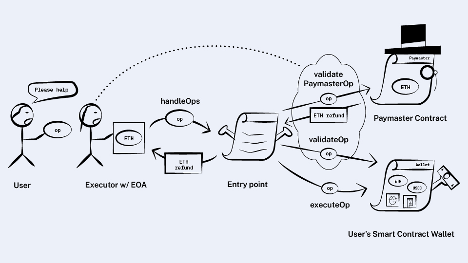

*원문: https://www.alchemy.com/blog/account-abstraction-paymasters*

## Sponsoring Transactions Using Paymasters

지난 글에서 (여러 역할을 분담하는 컨트랙트를 통해) EOA의 기능을 그대로 구현했고 사용자가 자신만의 유효성 검사 로직을 선택할 수 있도록 했습니다.  

그런데 지갑은 여전히 가스비를 내야하고, 이것은 지갑 주인이 온체인에 어떤 작업을 수행하려면 이더를 가지고 있어야 한다는 것을 의미합니다. 

만약 지갑 소유자 대신에 다른 누군가가 가스비를 내주는 경우가 필요하다면 어떻게 해야 할까요?

**이것이 필요한 이유들이 있습니다:**

- 지갑 소유자가 블록체인을 처음 사용하는 사람이라면, 온체인에서 무엇을 실행하기 전에 이더를 확보해야 할 필요가 있는데 이것이 어려운 일이 될 수 있습니다.
- 잠재적인 고객들이 주저하지 않도록 애플리케이션이 가스비를 대신 내주는 것을 원할 수도 있습니다.
- 스폰서가 가스비를 이더가 아닌, USDC 같은 다른 토큰으로 내는 것을 허용할 수도 있습니다(역주: 스폰서가 이더로 가스비를 내주고 사용자에게는 USDC를 청구한다는 의미).
- 개인정보 보호 차원에서, 사용자가 믹서를 통해 새 주소로 자산을 인출하여 관련없는 계정에서 가스비를 내고 싶어할 지도 모릅니다.   

### Introducing paymasters

내가 다른 사람의 가스비를 대신 내주는 dapp이라고 해봅시다. (그렇다고 해도) 아마 모든 사람들의 가스비를 전부 내주고 싶지는 않을텐데, 
그래서 사용자 요청을 확인하고 그 요청의 가스비를 대신 내줄지 말지를 결정하는 어떤 로직을 체인에 적용할 필요가 있을 겁니다.

로직을 체인에 적용하려면 컨트랙트를 배포해야 하고 그것을 "paymaster"라고 하겠습니다.

이것은 사용자 요청을 검사하여 가스비 지불 여부를 결정하는 하나의 메소드만 가지게 될 것입니다:

```solidity
contract Paymaster {
  function validatePaymasterOp(UserOperation op);
}
```
이렇게 되면, 지갑이 사용자 요청을 제출할 때 가스비를 부담해줄 paymaster가 지정되어 있는지(paymaster가 있다면) 확인할 필요가 있습니다.

사용자 요청에 새로운 항목을 추가하겠습니다. 또 paymaster가 지불 여부를 판단하는데 필요한 어떤 데이터를 전달하기 위한 
항목도 추가합니다. 예를 들어 오프체인에서 paymaster 관리자가 서명한 어떤 데이터일 수 있습니다.

```solidity
struct UserOperation {
  // ...
  address paymaster;
  bytes paymasterData;
}
```
다음에는, 새로 추가된 paymaster를 처리하기 위해 `entry point`의 `handleOps`를 수정합니다. 이것은 다음과 같이 동작할 것입니다. 

각 요청에 대하여:
- 전송자가 지정한 지갑의 `validateOp`을 호출합니다.
- 요청에 paymaster 주소가 있다면 paymaster의 `validatePaymasterOp`을 호출합니다.
- 유효성 검사에서 실패한 요청들은 폐기합니다.
- 지갑의 `executeOp`을 실행하고 소모된 가스를 추적하여 그에 상응하는 이더를 실행자에게 지불합니다. paymaster 항목이 있다면 
paymaster가 그것을 지불합니다. 그렇지 않으면 이전과 동일하게 지갑이 부담합니다.

지갑에서와 마찬가지로, paymaster는 `entry point`의 `deposit` 메소드를 통해 이더를 미리 예치합니다.



매우 간단하죠?

번들러도 시뮬레이션을 변경할 필요가 있습니다.

### Paymaster staking

이전 글에서 지갑이 번들러에게 가스비를 되돌려 주는 부분에서, 번들러는 유효성 검사의 실패를 피하기 위해서 시뮬레이션을 수행한다고 했습니다. 왜냐하면 유효성 검사가 실패하면 가스비를 환불받지 못하므로 
가스비만 날리는 셈이기 때문입니다.

**여기서도 같은 문제가 발생합니다.**

paymaster에서 유효성을 통과하지 못하면 가스비를 돌려주지 않으므로 번들러는 paymaster 검사를 통과하지 못하게 될 사용자 요청을 처리하지 말아야 합니다.  

우선적으로 `validateOp`에 적용했던 것과 동일한 제한을 `validatePaymasterOp`에도 할 것 같습니다(즉 지갑 자신과 지갑과 관련된 스토리지에만 접근 가능하며 금지된 opcode를 쓰지 말아야 한다는 등의). 그렇게 되면 
번들러는 사용자 요청에 대해 `validatePaymasterOp`과 `validateOp`을 동시에 시뮬레이션할 수 있게 됩니다.

그러나 여기서 주의할 것이 있습니다.  
`validateOp`는 지갑과 연관된 스토리지에만 접근할 수 있다는 제약사항이기 때문에 번들링된 다수의 요청들이, 다른 지갑들이라면, 서로 간섭하지 않을 것이라는 사실을 
알고 있습니다. 하지만 같은 paymaster를 사용하는 요청들은 그 paymaster의 스토리지를 공유하게 됩니다.  

이것은 `validatePaymasterOp`이 한번 수행되고나면 동일한 paymaster를 사용하는 나머지 요청들이 유효성 검사에서 
실패할 가능성이 있다는 것을 의미합니다. 

나쁜 paymaster는 이것을 서비스 거부 공격(DoS)으로 사용할지도 모릅니다.

이것을 막기 위해 평판 시스템(reputation system)을 도입하겠습니다.

번들러는 각 paymaster들이 최근에 얼마나 자주 유효성 검사에 실패했는지 추적하고 그런 payamster를 이용하는 요청을 
금지하거나 유입을 차단하므로써 paymaster에게 페널티를 주는 것입니다.

이러한 평판 시스템은 나쁜 payamster가 스스로 (역주: 자신에게 좋은 평판을 매기는 계정들을) 수없이 복제한다면(Sybil 공격) 제대로 동작하지 않을 것입니다. 그래서 paymaster에게 
이더를 스테이킹하도록 할 것입니다. 다수의 계정을 만드는 것이 이익이 되지 않도록 하는 것입니다.

**`entry point`에 스테이킹을 위한 새로운 메소드를 추가합니다:**

```solidity
contract EntryPoint {
  // ...

  function addStake() payable;
  function unlockStake();
  function withdrawStake(address payable destination);
}
```
한번 스테이킹이 되면 `unlockStake`을 호출한 후에 일정한 시간이 지날 때까지는 인출되지 않습니다. 새로운 메소드들은 
지갑과 paymaster의 가스비 예치 메소드인 `deposit`과 즉시 인출이 이루어지는 `withdrawTo`와 구별됩니다.  

**스테이킹에는 예외가 하나 있습니다:**

paymaster가 지갑과 연관된 스토리지에만 접근하고 자신의 스토리지에는 접근하지 않는다면 스테이킹을 할 필요가 없습니다. 왜냐하면, 이 경우에는
각 지갑의 `validateOp`와 같이 번들 안에 있는 다수의 요청에 의한 스토리지 접근이 겹치지 않을 것이기 때문입니다.

사실 평판 시스템의 자세한 규칙들을 이해하는 것이 그렇게 중요한 것 같지는 않습니다. [여기에](https://github.com/ethereum/EIPs/blob/master/EIPS/eip-4337.md#specification-2) 더 상세한 내용이 있습니다.
하지만 가스비를 소진시켜버리는 paymaster의 요청을 가려내는 메커니즘을 번들러가 가지고 있다는 것을 아는 것만으로 충분할 것 같습니다.

또 각 번들러는 평판을 로컬에 추적하고 있어서, 작업에 도움이 되고 다른 번들러들과 문제를 일으키지 않는다면 
평판을 산정하는 그들만의 로직을 자유로롭게 구현할 수 있습니다. 

>💡다른 스테이킹 시스템과는 다르게, 스테이커에게는 벌금(slashed)이 없습니다. 그들은 있을지도 모를 공격자에게 많은 자금이 
필요하게 만들고, 락업시키는 하는 역할을 합니다(역주: 공격비용을 증가).

### Improvement: Paymaster `postOp`

paymaster에 기능을 추가하여 약간 더 개선해보겠습니다. 현재 paymaster는 실제 실행 전에 유효성 검사 단계에서만 
호출됩니다.   

하지만 실행의 결과에 따라 어떤 다른 일을 수행할 필요가 있을지도 모릅니다. 

예를 들면, 사용자가 가스비를 USDC로 지불할 수 있게 허용하는 paymaster는 USDC를 청구하기 위해서 요청에 소모된 가스량을 알 필요가 있습니다.

따라서 새로운 메소드 `postOp`를 추가하겠습니다. 이것은 `entry point`가 요청을 처리한 후에 얼마의 가스가 사용되었는지 
전달할 때 호출될 것입니다.

또 paymaster가 어떤 정보를 다시 자신에게 전달해서 실행 후(post-op) 단계에서 유효성 검사 동안 처리된 데이터를 이용하는 경우도 있을 수 있습니다.
그래서 임의의 "컨텍스트" 데이터를 나중에 `postOp`으로 전달할 수 있도록 합니다.

**`postOp`를 다음과 같이 만들어보겠습니다:**

```solidity
contract Paymaster {
  function validatePaymasterOp(UserOperation op) returns (bytes context);
  function postOp(bytes context, uint256 actualGasCost);
}
```
하지만 paymaster가 나중에 USDC로 청구하는 방식은 까다로운 부분이 있습니다. 

아마 paymaster는 실행하기 전(`validatePaymasterOp` 단계)에서 사용자가 충분한 USDC를 가지고 있는지 확인했을 것입니다.
하지만 실행하는 동안에 지갑의 USDC를 모두 인출해버리는 것이 가능하기 때문에, 이것은 paymaster가 마지막 단계에서 가스비를 받지 못한다는 것을 의미합니다. 

>💡paymaster가 시작 단계에서 최대 (최대 가스에 상당하는) USDC를 청구하고 남는 것은 나중에 되돌려주면 이런 상황을 
피할 수 있지 않을까요? 가능한 이야기입니다. 하지만 그렇게 하면 두 번의 `transfer` 호출이 필요하고 가스가 더 들것입니다. 또 두 번의 
`Transfer` 이벤트가 발생할 것입니다. 다른 개선책이 있는지 살펴보겠습니다.

(그래서) 요청이 실행이 된 후에도 paymaster가 요청을 무효화시킬 수 있는 방안이 필요합니다. 만약 그렇게 되면 어떤 경우라도 이미 `validatePaymasterOp` 단계에서 
가스비를 청구하는 것에 동의했기 때문에 가스비를 인출할 수 있어야 합니다.

이 방법을 적용하려면 `entry point`가 `postOp`를 두 번 호출할 수 있도록 만들어야 합니다. 

`entry point`는 지갑의 `executeOp`가 실행되는 과정에서 `postOp`을 한번 실행할 것이고 만약 `postOp`이 
revert 된다면 `executeOp` 역시 revert 될 것입니다.

이런 상황이 발생하게 되면, `entry point`는 `postOp`를 한번 더 호출합니다. 하지만 이번에는 `executeOp`이 실행되기 전 상태, 즉 
`validatePaymasterOp`만 통과된 상태이므로 paymaster는 가스비를 인출할 수 있어야 합니다.

`postOp`에 (이러한) 맥락을 반영하기 위해 파라미터 하나를 더 추가하겠습니다: 그것이 revert 후에 "두 번째 실행"인지를 식별할 수 있는 
플래그를 두는 것입니다:

```solidity
contract Paymaster {
  function validatePaymasterOp(UserOperation op) returns (bytes context);
  function postOp(bool hasAlreadyReverted, bytes context, uint256 actualGasCost);
}
```

### Recap: How paymasters enable sponsored transactions
지갑 소유자가 아닌 다른 사람이 가스비를 지불하도록 하기 위해서, 새로운 주체인 **paymaster**를 도입했습니다. paymaster는 아래와 같은 인터페이스를 가진 
스마트 컨트랙트를 배포할 것입니다.

```solidity
contract Paymaster {
   function validatePaymasterOp(UserOperation op) returns (bytes context);
   function postOp(bool hasAlreadyReverted, bytes context, uint256 actualGasCost);
}
```

사용자 요청에는 지정된 paymaster를 나타내는 새로운 항목이 추가됩니다.

```solidity
struct UserOperation {
  // ...
  address paymaster;
  bytes paymasterData;
}
```

paymaster는 지갑과 마찬가지 방식으로 `entry point`에 이더를 예치합니다.  
`entry point`는 `handleOps` 메소드를 수정해서 각 요청에 대하여, `validateOp`을 통한 지갑의 유효성 검사와 요청에 지정된 
paymaster의 `validatePaymasterOp`으로 paymaster를 검증합니다. 그리고 마지막에는 paymaster의 `postOp`을 
호출합니다.

paymaster의 유효성을 시뮬레이션하는 과정에서 발생할 수 있는 불상사를 막기 위해, 이더를 락업해주는 스테이킹 시스템을 도입할 
필요도 있었습니다.

이를 위해 `entry point`에 몇 가지 메소드가 추가됩니다.

```solidity
contract EntryPoint {
  // ...

  function addStake() payable;
  function unlockStake();
  function withdrawStake(address payable destination);
}
```

paymaster를 추가함으로써 대부분 사람들이 계정 추상화를 생각하면서 바라는 많은 기능들을 구현할 수 있습니다!

점점 ERC-4337에 가까워지고 있습니다. 그러나 같아지려면 아직도 몇 가지 기능이 더 필요합니다.  

Feels good to be here!

[이전](./1.md) | [다음](./3.md)