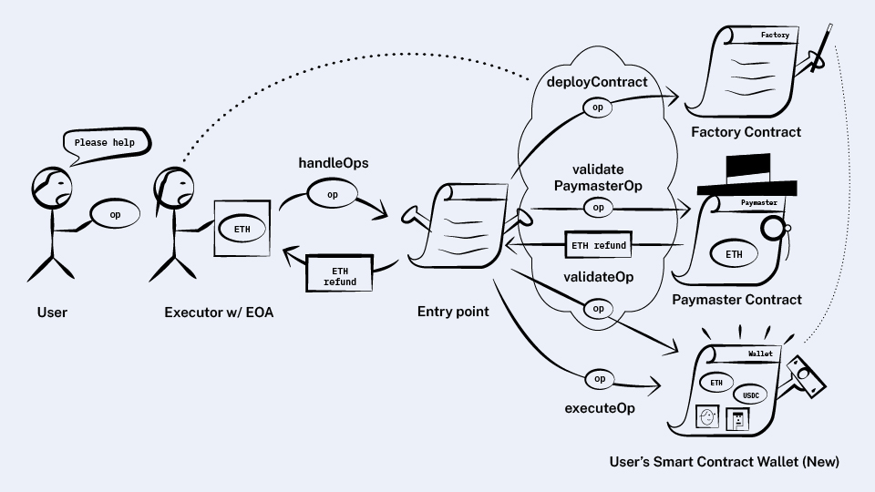

*원문: https://www.alchemy.com/blog/account-abstraction-wallet-creation*

## Wallet creation

지금 아직 다루지 않은 것은 각 사용자의 지갑 컨트랙트를 처음에 어떻게 올려야 하는가라는 것입니다.
컨트랙트를 배포하는 "고전적인" 방식은 EOA가 수신자가 없는 배포 코드 트랜잭션을 전송하는 것입니다. 그런데 그런 방법은 여기서 
만족스럽지 않습니다. 왜냐하면 우리가 만들었던 것들은 EOA 없이도 블록체인과 연결하는 방식이었기 때문입니다. 
사용자가 항상 EOA 계정을 만들고나서야 시작할 수 있다면 그게 무슨 소용일까요? 

우리가 하고자 하는 것은, 지갑이 필요한, 그러나 아직 지갑이 없는 누군가에게 새로운 온체인 지갑을 가질 수 있도록 
하는 것인데, 이 과정에서 이더로 가스비를 지불할 수도 있고(설령 지갑이 없더라도), 아니면 가스비를 대신 내줄 paymaster를 찾아서(두 번째 글에서 다룬 적이 있음), 
EOA 계정을 생성하지 않고도 할 수 있기를 바라는 것입니다.

매우 중요하지만 불분명한 또 다른 목표도 있습니다. 

새로운 EOA 계정을 생성할 때, 로컬에서 개인 키를 생성하기만 하면 그 어떤 트랜잭션을 보내지 않아도 계정을 가질 수 있습니다. 
한번도 거래를 일으킨 적이 없어도 내 계정 주소를 다른 사람에게 말하면 이더나 토큰을 받을 수 있습니다. 

그래서 지갑(컨트랙트)도 같은 식으로 동작했으면 좋겠습니다. 다른 사람에게 우리의 (지갑)주소를 말하면, 실제 지갑 컨트랙트를 배포하기 전이라도 
자산을 받을 수 있어야 한다는 것입니다.

### Prerequisite: Deterministic contract addresses with CREATE2

컨트랙트를 실제로 배포하기 전에 어떤 주소로 자산을 받을 수 있다는 것이 이것을 구현하는데 필요한 힌트입니다. 이것은 배포된 
지갑 컨트랙트가 없다고 해도 나중에 배포하고나면 얻게 될 지갑주소를 알아야 한다는 것을 의미합니다.

>💡아직 배포하지 않았지만 배포되면 만들어질 주소를 "counterfactual" 주소라고 합니다. 멋진 이름입니다.
(역주: "counterfactual wallet"은 레이어2에서 종종 등장하는 개념으로 새로운 것은 아님)

이것을 가능하게 하는 주요 구성요소는 `CREATE2` opcode인데 바로 이런 목적을 위해 만들어졌습니다. 이것은 다음 항목들을 입력값으로 해서, 미리 계산되어 결정된(deterministically) 
주소로 컨트랙트를 배포합니다:

- CREATE2를 호출하는 컨트랙트의 주소
- 32 바이트의 난수값(salt)
- 배포될 컨트랙트의 init 코드

init 코드는 EVM 바이트코드의 바이너리 데이터로, 다른 EVM 바이트코드를 리턴해서 신규로 생성된 스마트 컨트랙트로 저장시키는 
기능을 합니다(역주: init 코드는 생성자 코드가 포함되어 배포 시점에 실행되고 그 후에는 생성자 코드가 제외된 바이트 코드가 블록체인에 저장되는 것을 의미하는 듯).

이것은 사람들이 잘 모르는 흥미로운 부분입니다: **컨트랙트를 배포할 때 전송된 코드와 저장되는(역주: 배포된 후) 코드가 같지 않다**는 것 말입니다.
특히 동일한 init 코드를 계속 배포한다고 해도 배포된 컨트랙트가 같은 코드를 가지고 있다고 보장할 수 없습니다. 왜냐하면 init 코드가 스토리지를 조회하거나 
`TIMESTAMP` 같은 opcode를 사용하는 경우가 있을 수 있기 때문입니다.

### First attempt: Entry point deploys arbitrary contracts

`CREATE2`에 대해 알았으니 첫 번째 계획은 간단해졌습니다. 사용자들로부터 init 코드를 받아서 아직 존재하지 않으면 `entry point`가 그 컨트랙트를 배포하도록 합니다. 
먼저 사용자 요청에 다음 항목을 추가합니다.

```solidity
struct UserOperation {
  // ...
  bytes initCode;
}
```

그 다음에는 `entry point`의 유효성 검사 부분인 `handleOps`를 아래와 같이 수정합니다:

사용자 요청 검사 과정에서, `initCode`가 비어있지 않으면 `CREATE2`를 사용하여 컨트랙트를 배포합니다. 그리고 나머지 검사를 실행합니다:

- 방금 배포된 지갑 컨트랙트의 `validateOp` 메소드를 호출합니다.
- 요청에 paymaster가 있다면 paymaster의 `validatePaymasterOp` 메소드를 호출합니다. 

정말 괜찮은 시도 같습니다!

위에서 언급했던 모든 목표를 달성했습니다:  
사용자는 임의의 컨트랙트를 배포할 수 있고 배포될 주소를 미리 알 수 있습니다. 또 paymaster가 배포를 후원해줄 수도 
있고 사용자가 직접 가스비를 낼 수도 있습니다(배포될 지갑 주소에 이더를 보낸다면).

그러나 결함이 몇가지 있는데, 사용자가 임의의 바이트코드를 보내고 `entry point`가 그것을 검사해야 한다는 부분이 문제입니다. 

- paymaster가 사용자 요청을 보고 가스비 지불 여부를 결정하는 과정에서 바이트코드 바이너리 데이터를 분석하기 어렵습니다.
- 사용자가 배포용 바이트코드를 전송할 때 해당 바이트코드가 제대로 동작할지 바로 검증할수 없습니다. 사용자가 배포 도구를 사용한다면 
만약 그 도구가 악성 코드를 가지고 있거나 해킹되면 배포 컨트랙트에 백도어가 삽입될 수 있습니다. 이러한 속임수는 금방 알아차릴 수 없습니다. 
- 첫 번째 글을 상기해봅시다. 번들러는 각 요청들에 대해 유효성 검사 시뮬레이션을 수행해서 번들 안에 실패할 요청들이 
포함되어 가스비를 손해보는 경우를 방지했습니다. 하지만 init 코드는 그 어떤 코드도 가능하므로 시뮬레이션에서 문제가 없어도 실제 실행에서는 실패할 수 있습니다.

사용자가 임의의 바이트코드를 보내지 않아도 컨트랙트를 배포할 방법이 필요합니다. 그리고 다른 참여자들이 배포 과정에 대해 
어떤 보장을 해줄 수 있는 방안도 있었으면 좋겠습니다. 

이번에도 마찬가지로 더 많은 보증인이 필요한 시점이고, 새로운 컨트랙트를 도입할 때가 된 것 같습니다.

### Better attempt: Introducing factories

`entry point`가 임의의 배포 코드를 받아서 `CREATE2`를 호출하는 대신, 사용자가 컨트랙트를 하나를 선택해서 `CREATE2`를 
호출하도록 하려고 합니다. 이들 컨트랙트들을 **팩토리(factories)** 라고 하는데, 여러 다른 종류의 지갑 컨트랙트를 생성하는데 특화된 컨트랙트입니다. 

예를 들면, Carbonated Courage 토큰을 보관하는 지갑을 생성하는 팩토리가 있을 수 있고, 5개의 키중 3개의 키로 서명을 해야 하는 
지갑을 만드는 팩토리가 있을 수도 있습니다.

**팩토리는 컨트랙트를 생성할 때 호출해야 하는 메소드를 외부에 제공합니다.** 

```solidity
contract Factory {
  function deployContract(bytes data) returns (address);
}
```
>💡팩토리는 새로 배포된 주소를 리턴하기 때문에 사용자는 이 메소드를 시뮬레이션해서 배포된 후에 가지게 될 컨트랙트의 주소를 알 수 있습니다.

**사용자 요청에 항목을 추가하여 만약 지갑을 배포하는 요청이라면 어느 팩토리를 사용할지, 그리고 그 팩토리에 전달할 테이터를 받을 수 있도록 합니다:**

```solidity
struct UserOperation {
  // ...
  address factory;
  bytes factoryData;
}
```



이렇게 해서 앞에서 제기된 두 가지 문제를 해결할 수 있었습니다!

- 사용자가 Carbonated Courage를 보관하는 지갑 팩토리를 호출하면 그 팩토리 컨트랙트는 검증된(audited) 것이고, 백도어 같은 것이 
없다고 판단할 수 있습니다. 그래서 바이트 코드를 검사하지 않아도 됩니다.
- payamster는 승인된 팩토리로 배포되는 경우 선택적으로 가스비를 내줄 수 있습니다.

아직 남은 문제는 배포 코드가 시뮬레이션에서는 성공했지만 실제 실행에서 실패하는 경우입니다.

이것은 paymaster의 `validatePaymasterOp`를 만들 때 부딪힌 문제와 완전히 동일한 경우이고 같은 방식으로 해결할 수 있습니다.

번들러는 팩토리와 지갑이 그에 연관된 스토리지에만 접근할수 있도록 제한합니다. 그리고 `TIMESTAMP` 같은 금지된 코드들이 
있는지 확인합니다.

또한 팩토리가 `entry point`의 `addStake` 메소드를 사용하여 이더를 예치하게 할 수도 있을 것입니다. 번들러는 
최근 시뮬레이션에서 얼마나 자주 문제를 일으킨 팩토리인지 추적할 수 있고 이들을 차단하거나 금지할 수 있을 것입니다. 

>💡paymaster에서 처럼, 배포 메소드가 팩토리 자신과 연관된 스토리지가 아닌, 배포되는 지갑과 관련된 스토리지만 사용하다면 스테이킹을 할 필요는 없습니다. 

And we’ve done it!

지갑 생성을 이보다 더 좋게 만들 수는 없을 것 같군요.

여기까지 해서, 우리가 설계한 구조가 실제 ERC-4337의 모든 기능들을 수행할 수 있습니다!

마지막 네 번째 글에서 다루게 될 목표는 압축(aggregating) 서명에 관한 것인데, 이것은 가스비를 최적화하는데 도움을 
주지만 새로운 기능이 추가되는 것은 아닙니다.

여기서 그만 하고 성공을 자축해도 될 것 같습니다. 하지만 가스비를 절약하고 싶다면 다음 글을 계속...


[이전](./2.md) | [다음](./4.md)