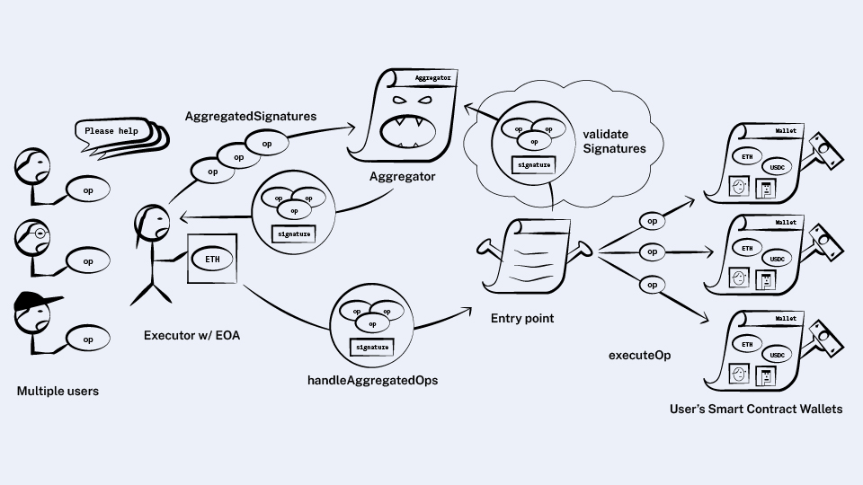

*원문: https://www.alchemy.com/blog/account-abstraction-aggregate-signatures*

## Aggregate signatures

현재 구현에서는 번들 안에 있는 각 사용자들의 요청을 개별적으로 검증하도록 되어 있습니다. 이런 방식은 유효성을 검사하는 
직접적인 방식이고 다소 비효율적인 면이 있습니다. 서명을 검증하는 것은 암호학적인 연산을 필요로 하기 때문에 가스 소비 
측면에서 비싼 작업입니다. 

**모든 서명을 하나씩 검증하는 대신 한번 검증으로 다수의 사용자 요청들을 동시에 처리하면 좋지 않을까요?**

그렇게 하기 위해서는 압축 서명(aggregate signatures)이라는 암호학적인 개념을 가져와야 합니다.

압축 서명을 지원하는 서명 구조는, 서로 다른 키로 서명된 여러 개의 메시지가 있을 때, 서명을 합쳐서 한 개의 서명을 
생성하는 방법입니다. 이 서명을 검증하면 그 안에 있는 모든 서명들이 유효하다는 것을 증명할 수 있습니다.

이러한 서명 구조가 가능한 것들 중 하나가 BLS입니다(역주: BLS는 보네-린-샤참이 제안한 타원곡선 암호 기반 디지털 서명 방식).

이 방식은 데이터를 압축하면서 서명까지 압축할 수 있어서 롤업을 구현할 때 특히 유용합니다.

압축 서명에 대한 설명은 [비탈릭의 트윗](https://twitter.com/VitalikButerin/status/1554983955182809088)을 참고하기 바랍니다.

### Introducing aggregators

(하지만) 번들 안에 있는 사용자 요청의 서명들을 전부 압축할 수 없다는 것을 깨닫게 되는데, 지갑은 서명을 확인하는 자신만의 로직을 가지고 있고, 그래서
다양한 서명 방식들이 존재할 수 있기 때문입니다.

다른 구조를 지닌 서명은 같이 압축할 수 없기 때문에 번들은 사용자 요청의 그룹들로 나누어지게 될 것입니다. 각 그룹들은 다른 압축 서명 구조를 가지거나 또는
그런 구조가 아예 없을 수도 있습니다.

각자 로직에 맞는 다양한 압축 서명 방식이 온체인에 필요하므로 각 구조들을 처리하는 `aggregator`라고 하는 컨트랙트가 있어야 합니다.

압축 방식은 다수의 서명을 어떻게 합쳐서 하나로 만들고 검증할 수 있는지를 정의합니다. 그래서 `aggregator`는 다음 두 개의 메소드를 가지고 있습니다.

```solidity
contract Aggregator {
  function aggregateSignatures(UserOperation[] ops) returns (bytes aggregatedSignature);
  function validateSignatures(UserOperation[] ops, bytes signature);
}
```


각 지갑들은 자신만의 서명 구조를 정의하고 있으므로 어느 `aggregator`를 사용할지는 지갑에 달려 있습니다.  

**지갑이 압축 서명에 참여하려면 어떤 `aggregator`를 선택했는지 알려주는 메소드를 제공해야 합니다:**

```solidity
contract Wallet {
  // ...

  function getAggregator() returns (address);
}
```
새로운 메소드인 `getAggregator`을 사용하여 번들러는 같은 서명 방식을 사용하는 요청들로 묶을 수 있습니다. 그리고 
`aggregator`의 `aggregateSignatures` 메소드로 서명들을 합치면 됩니다.

서명 그룹은 다음과 같은 형식이 될 겁니다: 

```solidity
struct UserOpsPerAggregator {
  UserOperation[] ops;
  address aggregator;
  bytes combinedSignature;
}
```

>💡번들러가 오프체인에서 특정 `aggregator`에 대해 알고 있다면 EVM에서 `aggregateSignatures`을 실행하는 대신 서명 알고리즘을 네이티브하게 구현해서 압축 서명을 최적화 할 수도 있습니다.  

다음에는, `entry point` 컨트랙트가 새로운 압축 서명을 활용할 수 있도록 수정하는 일입니다.
`entry point`은 `handleOps` 메소드에서 요청 목록을 사용한다는 것을 상기해봅시다.

**새로운 메소드 `handleAggregatedOps`를 만듭니다. 이 메소드는 같은 작업을 수행하지만 `aggregator`에 의해 그룹핑된 요청들을 전달받습니다:**

```solidity
contract EntryPoint {
  function handleOps(UserOperation[] ops);

	function handleAggregatedOps(UserOpsPerAggregator[] ops);

  // ...
}
```

`handleAggregatedOps`은 `handleOps`은 많은 부분에서 같지만 서명 확인 단계에서 차이가 있습니다.  
`handleOps`는 각 지갑의 `validateOp`을 호출하면서 유효성 검사를 수행하는 반면, `handleAggregatedOps`은 각 그룹에 적용된 서명 구조에 따라 합쳐진 서명을 `aggregator`의 `validateSignatures`에 
전달하여 검증하게 됩니다.



거의 다 완성했습니다!

그런데 여기서 자주 부딪힌 한가지 문제가 있습니다.

번들러는 유효성 검사 시뮬레이션을 수행해야 하고 요청들이 번들에 포함되기 전에 `aggregator`가 요청 그룹을 검증하도록 할 것입니다. 왜냐하면
유효성 검사가 실패하면 번들러가 가스비를 부담해야 하기 때문입니다. 그러나 임의의 로직을 가진 `aggregator`는 시뮬레이션에서 성공하지만 실제 실행에서 실패할 수 있습니다.

이런 문제는 paymaster나 팩토리와 같은 방식으로 해결할 것입니다: `aggregator`가 접근할 수 있는 스토리지와 opcode에 제한을 두고 이더를
`entry point`에 스테이킹하게 만드는 것입니다.

이것으로 압축 서명에 대한 이야기를 마무리 하겠습니다!

### Wrap up

지금까지 ERC-4337의 구조와 거의 유사한 계정 추상화를 만들어보았습니다! 메소드 이름이나 전달인자 같은 상세 부분에서 몇 가지 차이점이 있기는 합니다. 
하지만 구조적인 차이는 없을 것 같습니다. 이 글의 내용이 잘 전달되었다면 실제 ERC-4337을 보고 어떻게 돌아가는지 이해하는데 문제가 없을 것입니다.   

지금까지 읽어주셔서 감사합니다. 이 글을 쓰는 것이 저에게 도움된 것처럼 여러분에게도 도움이 되었기를 바랍니다. 

## Addendum: Differences from ERC-4337
**부록: ERC-4337과의 차이점**

계정 추상화의 전반적인 구조에 대해서 알아보았는데, ERC-4337을 설계한 스마트한 사람들의 생각과 이 글에서 설명한 것이 다소 차이나는 부분들이 있습니다.  

한번 살펴보겠습니다!

### 1. Validation time ranges

앞 글에서는 지갑의 `validateOp`과 paymaster의 `validatePaymasterOp`의 리턴 타입에 대해 특별히 언급하지 않았습니다.
ERC-4337 에서는 이것을 활용하는 방법을 제시합니다.

지갑이 제일 잘 하는 일은 사용자 요청을 일정한 시간 동안만 유효하게 하는 것입니다. 그렇지 않으면 나쁜 번들러가 그 요청을 
계속 가지고 있다가 나중에 이익을 보는 시점에 번들에 포함시킬 수도 있습니다.

지갑은 요청이 곧 실행될 것임을 확인하기 위해, 유효성 승인 중에 `TIMESTAMP`를 검사함으로써 이러한 상황에 대비하기를 원할 것입니다.
그러나 유효성 검사에서는 시뮬레이션의 부정확성을 막기위해 `TIMESTAMP`를 금지했기 때문에 그렇게 하기 어렵습니다.
이것은 요청이 유효한 시간을 가리키는 다른 방법이 필요하다는 것을 의미합니다.

**그래서 ERC-4337에서는 `validateOp`에서 지갑이 시간 간격을 선택할 수 있도록 값을 리턴합니다:**

```solidity
contract Wallet {
  function validateOp(UserOperation op, uint256 requiredPayment) returns (uint256 sigTimeRange);
  // ...
}
```
이 값은 8바이트짜리 정수 두 개를 사용하여 해당 요청의 유효한 시간 범위를 나타냅니다.
(역주: ERC-4337에는 다음과 같이 되어 있음: `validUntil` is 8-byte timestamp value, or zero for "infinite". The UserOp is valid only up to this time.
`validAfter` is 8-byte timestamp. The UserOp is valid only after this time).

이것 외에도 ERC-4337은 다른 점이 있습니다: 지갑은 `validateOp`에서, 유효성 검사에 실패한 경우 revert 하기 보다는 
감시자 값(sentinel value, 역주: 여기서는 실패했음을 알려주는 값)을 리턴해야 한다고 되어 있습니다. 이것은 가스를 산정하는데 필요한데, 왜냐하면 revert 가 되어버리면 
`eth_estimateGas`으로 얼마의 가스가 들었는지 알 수 없기 때문입니다.

### 2. Arbitrary call data for wallets and factories

우리가 만든 지갑의 인터페이스는 아래와 같았습니다.

```solidity
contract Wallet {
  function validateOp(UserOperation op, uint256 requiredPayment);
  function executeOp(UserOperation op);
}
```

ERC-4337에는 `executeOp`이라는 메소드는 없습니다.

**대신에 사용자 요청에 `callData` 항목이 있습니다:**

```solidity
struct UserOperation {
  // ...
  bytes callData;
}
```
일반적인 스마트 컨트랙트에서는 (콜데이터의) 첫 번째 4바이트는 함수 셀렉터이고 나머지가 함수에 전달되는 파라미터들입니다.  

이것은 `validateOp`를 제외하고, 지갑은 자신들의 인터페이스를 정의할 수 있고 사용자 요청으로 지갑의 임의의 (이름을 가진) 메소드를 호출할 수 있다는 것을 
의미합니다.

같은 맥락으로, ERC-4337에서 팩토리 컨트랙트는 `deployContract`라는 메소드를 정의하지 않습니다. 사용자 요청에 `initCode` 항목이 있는 경우, 임의의 콜데이터를 받습니다. 

### 3. Compact data for paymasters and factories

앞선 글에서 사용자 요청에는 paymaster를 지정하는 항목과 거기에 전달하는 데이터 항목이 있다고 했습니다: 

```solidity
struct UserOperation {
  // ...
  address paymaster;
  bytes paymasterData;
}
```
**ERC-4337에서는 이들 항목들이 최적화의 이유로 하나로 합쳐져 있습니다. 첫 20바이트는 paymaster의 주소이며 나머지는 데이터입니다:**

```solidity
struct UserOperation {
  // ...
  bytes paymasterAndData;
}
```

팩토리도 같은 식으로 되어 있습니다. 우리는 두 개의 항목, `factory`와 `factoryData`를 만들었지만 ERC-4337에서는 
이것을 `initCode` 항목에 넣었습니다.

자, 이제 다 되었습니다!  
계정 추상화에 대해 많은 것을 알게 되었기를 바랍니다.

[이전](./3.md)