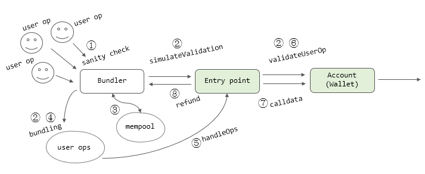
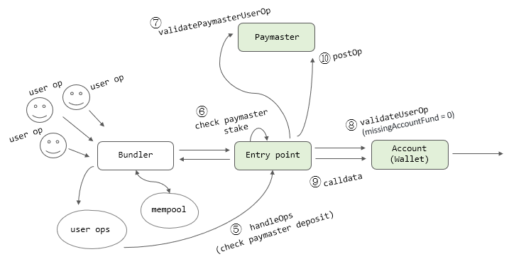

*원문: https://github.com/ethereum/EIPs/blob/master/EIPS/eip-4337.md*  

ERC-4337을 요약하고 정리합니다(원문과 주석 구분없이 작성). 이 표준은 현재(2023.03.10) draft 상태입니다(스펙이 조금씩 변경될 수 있음).

### 개요

이 스펙은 합의 계층 프로토콜의 변경없이 구현하는 계정 추상화(account abstraction)에 관한 제안입니다.
하위 프로토콜 레벨에 새로운 기능이나 트랜잭션 타입을 추가하는 대신(하드포크 대신), 상위 계층에서 `UserOperation`이라는 
트랜잭션과 유사한(pseudo-transaction) 객체를 도입합니다.  

사용자가 `UserOperation` 객체를 분리된 맴풀(mempool)에 전송합니다. 번들러(bundler)라고 하는 특별한 역할을 수행하는 사람들이 
이것을 모아서 `handleOps` 라는 하나의 트랜잭션으로 만들어 어떤 특별한 컨트랙트(a special contract)로 전송하고 
그 트랜잭션이 처리되어 결과가 블록에 저장됩니다. 

계정 추상화란 아주 단순하게 말하면 스마트 컨트랙트 지갑(SC wallet)을 의미하는 것으로 이해할 수 있습니다.  

"분리된 멤풀"의 의미는, 사용자 요청(`UserOperation`)은 이더리움 노드의 퍼블릭 멤풀에 직접 들어가는 것이 아니라 번들러를 거치게 되므로 번들러들의 멤풀을 
가리키는 것입니다. 과거 작업증명 때에도 플래시봇 서비스를 이용하는 사용자의 트랜잭션은 퍼블릭 멤풀로 가지 않고 번들링 과정을 거쳐서 전송되었으므로 그것과 유사하다고 보면 될 것 같습니다. 지분증명으로 
전환된 지금도 각 검증노드들은 mev-boost를 사용하여 외부의 블록 생성자들로부터 트랜잭션 처리를 아웃소싱하는 형태이므로 같은 맥락에 있습니다.

따라서 "분리된"의 의미는 이더리움 네트워크의 멤풀이 아닌 번들러 네트워크의 멤풀로 사용자 요청이 전송된다는 말입니다. 사용자 요청 멤풀은 중앙화된 
특정 노드의 멤풀이 아니라 공개된 멤풀입니다. 현재 이더리움의 환경과 유사하다고 보면 되겠습니다(번들러 노드와 네트워크가 
어떻게 구성될 것인지는 [다음 글](https://notes.ethereum.org/@yoav/unified-erc-4337-mempool)을 참조).


### 제안 동기

* Achieve the key goal of account abstraction: 계정 추상화의 핵심 기능의 구현   
* Decentralization: 탈중앙화, 번들러는 누구나 될 수 있음
* Do not require any Ethereum consensus changes: 이더리움 합의 프로토콜 레벨의 변경이 필요없음
* Try to support other use cases: 여러 유즈케이스를 지원
  * Privacy-preserving applications 
  * Atomic multi-operations
  * Sponsored transaction(대납 기능, ERC-20 토큰으로 수수료 납부 등)
  * Signature aggregation

### 상세 스펙

- [UserOperation](../contracts/interfaces/UserOperation.sol) - 사용자 트랙잭션에 해당하는 객체. "트랜잭션"과 구별하기 위해 이렇게 명명함(역주: "사용자 요청"이라고 하겠음). 트랜잭션처럼
"sender", "to", "calldata", "maxFeePerGas", "maxPriorityFee", "signature", "nonce" 등을 포함하고, 
트랜잭션에는 없는 다른 항목들을 포함. "nonce"와 "signature"는 프로토콜에서 지정된 것이 아니라 계정(지갑) 구현에 따라 다를 수 있음.
- Sender - 사용자 요청을 보내는 지갑 컨트랙트.
- EntryPoint - 번들링된 사용자 요청들을 처리하는 싱글톤 컨트랙트. 번들러/클라이언트는 지원하는 entry point를 화이트 리스팅함.
- Bundler - 다수의 사용자 요청을 모으는 노드(블록 생성자)로, `EntryPoint.handleOps` 트랜잭션을 생성. 하지만 모든 블록 생성자들이 번들러가 되어야 하는 것은 아님.
- Aggregator - 계정(지갑)이 신뢰하는 헬퍼 컨트랙트로, 압축 서명의 유효성을 검증. 번들러/클라이언트는 지원하는 aggregator를 화이트 리스팅함.

알케미 블로그에서 이미 등장한 용어들이라 이해하는데 큰 어려움은 없을 것 같습니다. `UserOperation`이라는 것은 결국
사용자가 지갑 컨트랙트를 통해 수행하려는 작업들의 집합이라고 볼 수 있습니다.

ERC-4337에서는 이더리움 프로토콜 변경을 하지않기 위해서, 새로운 계정 추상화용 트랜잭션 타입을 만들지 않았습니다. 대신에 `UserOperation`이라고 하는
ABI-인코딩된 데이터를 지갑에 전달하는 사용자 요청을 도입했습니다. 사용자 요청의 항목들은 아래와 같습니다:  

| 항목                     | 타입        | 설명                                                  |                                      
|------------------------|-----------|-----------------------------------------------------|
| `sender`               | `address` | 사용자 요청을 보내는 지갑 계정                                   |
| `nonce`                | `uint256` | 리플레이를 막는 파라미터; 처음 지갑 생성을 위한 salt로 사용                |
| `initCode`             | `bytes`   | 지갑의 initCode(아직 온체인에 없어서 경우 생성할 필요가 있다는 의미와 같음)     |
| `callData`             | `bytes`   | 메인 요청 실행 동안에 `sender`에게 전달되는 데이터                    |
| `callGasLimit`         | `uint256` | 메인 요청(실제 실행) 실행에 할당된 가스량                            |
| `verificationGasLimit` | `uint256` | 확인 단계(유효성 검사)에 할당된 가스량                              |
| `preVerificationGas`   | `uint256` | 콜데이터 및 사전 확인에 소요되는 가스 보정 값                          |
| `maxFeePerGas`         | `uint256` | 가스당 최대(허용) 수수료, EIP-1559의 `max_fee_per_gas`에 해당     |
| `maxPriorityFeePerGas` | `uint256` | 가스당 팁 수수료, EIP-1559의 `max_priority_fee_per_gas`에 해당 |
| `paymasterAndData`     | `bytes`   | paymaster의 주소와 전달할 데이터(직접 납부하는 경우는 빈 값)             |
| `signature`            | `bytes`   | 유효성 검사 단계에서 지갑으로 전달될 nonce 포함 데이터                   |

여기서 `sender`는 사용자 요청을 보내는 계정이 아니라 지갑 계정을 말합니다. 지금은 "EOA==지갑" 이므로 다소 어색할 수 있지만 
앞으로는 서명과 지갑 기능을 분리하여 생각해야 합니다(ERC-4337 개발자 바이스에 의하면 EOA는 더이상 쓰지 않을 것이라고 합니다). 

사용자는 사용자 요청을 전용 멤풀에 보냅니다. 번들러라고 부르는 참여자가(블록 생성자가 될 수도 있고, 블록 생성자에게 트랜잭션을 릴레이 해주는 사람들일 수도 있음, 
예를 들어 플래시봇 같은 번들 마켓플레이스를 통해 릴레이해주는 사람들) 멤풀에서 트랜잭션들을 가져와서 번들링 합니다.
다수의 사용자 요청을 포함한 하나의 번들 트랜잭션은 사전에 배포된 전역 entry point 컨트랙트의 `handleOps`를 호출하게 됩니다.

번들러의 역할을 블록 생성자와 구분하기 보다는 동일한 주체가 같이 수행할 것으로 예상됩니다. 지금도 블록 생성자와 릴레이가 같은 경우가 많습니다.

리플레이 공격을 막기 위해 서명에 `chainId`와 [entry point](../contracts/interfaces/IEntryPoint.sol) 컨트랙트 주소가 포함됩니다. 

스펙에 있는 [`IAccount`](../contracts/interfaces/IAccount.sol) 인터페이스는 지갑 컨트랙트의 인터페이스를 말합니다. 

```solidity
interface IAccount {
   function validateUserOp
      (UserOperation calldata userOp, bytes32 userOpHash, uint256 missingAccountFunds)
      external returns (uint256 validationData);
}
```
지갑 컨트랙트는:

- 자신을 호출하는 entry point가 검증된 컨트랙트 주소인지 확인해야 함.
- `userOpHash`는 사용자 요청과 `chainId`, 그리고 entry point 주소를 해시한 것임.
- 지갑이 서명 압축을 지원하지 않는 경우는, `userOpHash`의 서명이 유효한지를 반드시 확인해야 함. 만약 일치하지 않은 경우 
`SIG_VALIDATION_FAILED`로 정의된 값을(revert 하지 말고) 리턴해야 함(알케미 블로그에서 말한 "감시자 값"에 해당). 그 외에는 
revert 함.
- 지갑은 모자란 가스비 `missingAccountFunds`를 반드시 호출자인 entry point에게 지급해야 함(이미 예치된 금액이 충분한 경우 이 값은 0이 될 수 있음). 
- 지갑은 가스비를 초과 지급할 수도 있음(남는 것은 `withdrawTo`를 호출하여 언제든지 인출 가능).
- `aggregator`는 압축 서명을 사용하지 않는 지갑을 무시해야 함.
- 리턴 값에는 다음 세 개의 정보가 들어있음.
  - `authorizer` - 서명 검증 실패하면 1을 리턴. 그렇지 않으면 authorizer(aggregator) 컨트랙트의 주소를 리턴
  - `validUntil` - 8 바이트 타임스탬프, `userOp`은 이 시간까지 유효함, 0인경우 무한대.
  - `validAfter` - 8 바이트 타임스탬프, `userOp`은 이 시간이후부터 유효함.

지갑이 압축 서명을 지원하는 경우 다음 인터페이스도 구현해야 합니다.
```solidity
interface IAggregatedAccount is IAccount {
    function getAggregator() view returns (address);
}
```
`getAggregator`는 지갑이 사용하는 `aggregator` 컨트랙트의 주소를 리턴합니다.

다음으로 `IAggregator`는 아래와 같습니다:

```solidity
interface IAggregator {
   function validateUserOpSignature(UserOperation calldata userOp) external view returns (bytes memory sigForUserOp);
   function aggregateSignatures(UserOperation[] calldata userOps) external view returns (bytes memory aggregatesSignature);
   function validateSignatures(UserOperation[] calldata userOps, bytes calldata signature) view external;
}
```
- 지갑이 `aggregator`를 사용하는 경우(지갑이 `getAggregator`를 구현한 경우), `EntryPoint.simulateValidation`에서 `aggregator` 주소를 받음. 
압축 서명인 경우는 `ValidationResult` 대신 `ValidationResultWithAggregator`을 예외로 발생시켜 revert 함(시뮬레이션이므로).
- 사용자 요청을 받을 때 번들러는 `validateUserOpSignature`을 호출(각 요청에 대한 서명 확인).
- `aggregateSignatures`는 반드시 하나의 압축 서명 값을 생성해야 함.
- `validateSignatures`는 반드시 (압축 서명을 구성하는 모든) 사용자 요청들에 대해 확인해야 함. 실패하면 revert. 이 메소드는 `EntryPoint.handleOps`가 호출함.
- 번들러는 압축 서명을 만들고 검사하는 다른 네이티브 라이브러리를 `aggregator`를 대신에 사용할 수 있음.

번들러는 지갑이 지정한 `aggregator`를 사용할 때 그의 스테이킹 상태와 차단 여부를 확인해야 합니다. 만약 너무 많은 리소스를 
사용하거나 서명을 압축하는데 실패하는 경우에는 해당 `aggregator`를 차단할 수 있습니다.

**Required entry point contract functionality**  

[entry point](../contracts/interfaces/IEntryPoint.sol)에는 `handleOps`와 `handleAggregatedOps` 두 개의 메소드가 있습니다.

`handleAggregatedOps`는 다수의 사용자 요청에 대해 다수의 `aggregator` 를 batch 처리하는 메소드입니다. 당연히 각 사용자 요청에 대해 `aggregator`를 넘겨 주어야 하므로 다음과 같은 
구조체 타입 `UserOpsPerAggregator`의 배열을 파라미터로 받습니다.
```solidity
  struct UserOpsPerAggregator {
     UserOperation[] userOps;

     // aggregator address
     IAggregator aggregator;
     // aggregated signature
     bytes signature;
  }

  function handleAggregatedOps(
     UserOpsPerAggregator[] calldata opsPerAggregator, 
     address payable beneficiary
  ) external;
```
`handleOps`는 각 사용자 요청에 대하여 다음과 같은 검증 작업을 수행해야 합니다:

- 계정(지갑)이 존재하지 않는 경우 사용자 요청 항목에 있는 `initcode`를 사용하여 계정을 생성. 생성에 실패하는 경우는 중단.
- 계정(지갑)의 `validateUserOp`을 호출. 에러가 발생하는 경우 해당 요청만을 건너뛰거나 전체를 revert.
- 계정(지갑)이 entry point에 예치한 금액 확인(최대 사용 가스 기준).

위의 유효성 검사를 통과하면 실행 단계로 들어갑니다:

- 사용자 요청에 있는 콜데이터를 계정(지갑)으로 전송(즉 지갑의 어떤 함수를 호출).

번들러가 사용자 요청을 받아들이기 전에 RPC 메소드를 통해서 `EntryPoint.simulateValidation`를 호출하여 서명과 가스비 지불 가능 여부를 
검사합니다. `simulateValidation`은 결과를 커스텀 예외를 발생시켜서 리턴합니다. 그 외의 revert는 실패로 간주하여 멤풀에 넣지 않고 폐기 합니다.
예외는 `aggregator`를 사용하는 경우 스테이킹 정보를 넘겨야 하므로 `ValidationResultWithAggregation`을 사용합니다. 

```solidity
error ValidationResult(ReturnInfo returnInfo,
    StakeInfo senderInfo, StakeInfo factoryInfo, StakeInfo paymasterInfo);

error ValidationResultWithAggregation(ReturnInfo returnInfo,
    StakeInfo senderInfo, StakeInfo factoryInfo, StakeInfo paymasterInfo,
    AggregatorStakeInfo aggregatorInfo);
```

**Extension: paymasters**  

entry point를 확장해서 paymaster를 지원할 수 있습니다. paymaster는 스폰서 트랜잭션, 이를테면 가스비 대납과 같이 기존 
가스비 지불 흐름을 커스터마이징하는데 이용할 수 있는 방안입니다. 애플리케이션에서 특정 사용자들에게 가스비 할인 혜택을 준다든가 
이더로 가스비를 내는 대신 다른 ERC-20 토큰으로 낸다든가 하는 유즈 케이스들이 있을 수 있습니다. paymaster가 지정되면 다음과 같은 흐름이 됩니다:

entry point가 유효성을 검사하는 단계에서 `handleOps`는 먼저 paymaster가 요청에 대한 가스비 지불을 할 수 있는 충분한 자금이 
예치되어 있는지 확인한 후 paymaster 컨트랙트의 `validatePaymasterUserOp`을 호출합니다. 이 함수에서 해당 요청이 
paymaster가 지불할 대상이 되는지 판단하게 됩니다. 가스비는 paymaster가 지불하므로 지갑의 `validateUserOp`이 호출될 때는 
`missingAccountFunds`를 0으로 전달합니다.

`validatePaymasterUserOp`가 어떤 "컨텍스트" 데이터를 리턴하는 경우, 사용자 요청 처리 후에 entry point는 `postOp`을 호출해야 합니다. 
`postOp`는 메인 실행(즉 사용자 요청 처리)이 revert 되어도 호출을 보장해야 합니다. 이것은 `try-catch`의 `catch`절에서 한번 더 `postOp`이 
실행된다는 것을 의미합니다. 알케미 블로그에서 설명한 것처럼, 메인 실행이 revert 되어도 그동안 소모된 가스비에 대한 청구가 
가능해야 하기 때문입니다. 

나쁜 paymaster들을 막기 위해 평판 시스템(reputation system)을 도입하고 스테이킹을 하도록 합니다. 스테이킹된 이더는 일정 시간을 기다려야 인출이 가능합니다. 

**Client behavior upon receiving a UserOperation**

여기서 클라이언트와 번들러를 구분했는데, 클라이언트는 사용자 요청을 제일 처음 받는 사람을 말하고 번들러는 그것을 번들링하는 사람을 가리키는 것으로, 동일한 주체가 수행할 것으로 
예상됩니다. 클라이언트는 다음과 같은 기본 검사(sanity check)를 수행해야 합니다:

- 지갑 컨트랙트인 `sender`가 존재하는지 아니면 배포를 위한 `initCode`가 있는지 확인(동시에 둘 다 있으면 안됨).
- `initCode`의 첫 20 바이트는 팩토리 컨트랙트의 주소이고 다른 스토리지를 참조하는 경우 스테이킹이 되어 있는지 확인.
- `verificationGasLimit`이 `MAX_VERIFICATION_GAS`보다 작은지 확인. 그리고 `preVerificationGas`이 충분한지 확인(콜데이터를 serializing 하는 가스+`PRE_VERIFICATION_OVERHEAD_GAS`). 
- `paymasterAndData`는 paymaster의 주소로 시작하는데, 온체인에 당연히 배포가 되어 있어야 하고, 가스비 예치가 되어 있어야 하며, 차단되지 않은 상태이어야 합니다.
또 스테이킹이 필요할 수도 있습니다.
- `callGasLimit`는 실제 지갑 컨트랙트로 전달된 콜데이터(함수 호출)를 실행할 때 드는 가스를 지정하므로 최소한 `CALL` opcode 비용보다 커야 합니다.
- `maxFeePerGas`와 `maxPriorityFeePerGas`는 현재 `block.basefee`보다 커야 합니다.
- 멤풀에는 같은 사용자 요청이 하나 이상 존재할 수 없고(`maxPriorityFeePerGas`가 더 높으면 기존 요청을 대체 가능) 배치 내에서도 `sender`당 하나만 가능. 

`verificationGasLimit`은 사용자 요청의 유효성을 검사할 때 사용할 가스를 말합니다. `MAX_VERIFICATION_GAS`는 번들러가 설정하는 가스의 상한으로 추측됩니다. `preVerificationGas`는 사용자 요청의 "오버헤드" 비용에 해당하는데, EVM이 연산을
수행할 때 추가적으로 소요될 지도 모르는 가스를 고려한 것이라고 합니다. 새로 추가될 RPC 호출인 `eth_estimateUserOperationGas`을 사용하면 기준 값을 얻을 수 있을 것 같습니다.

위와 같은 기본 검사 후에는 시뮬레이션을 수행합니다. 시뮬레이션은 로컬에서 RPC 호출로 `EntryPoint.simulateValidation`을 실행하는 것을 말합니다. 이것을 통과하면 비로소 
사용자 요청을 멤풀에 넣게 됩니다.

**Simulation**  

시뮬레이션은 사용자 요청을 멤풀에 넣기 전에 유효한 요청인지, 가스비를 낼 수 있는지, 또 실제 메인 실행에서도 문제가 없는지 
검사하고 시험삼아 실행보는 것을 말합니다. 이러한 이유로 사용자의 요청은 시뮬레이션과 메인 실행 사이에 변경될 수 있는 값을 참조해서는 안됩니다.

지갑과 연계되는 세 개의 컨트랙트, 즉 factory, paymaster, aggregator들도 마찬가지 규칙을 적용받기 때문에 스토리지 접근에 제한을 
받을 수 있습니다.

시뮬레이션은 다음과 같이 수행됩니다:

번들러는 `EntryPoint.simulateValidation(userOp)`를 RPC 호출합니다. 이 메소드는 시뮬레이션이 정상적으로 실행되면 
`ValidationResult`라는 사용자 예외를 던집니다(오류를 의미하는 것이 아님). 만약 다른 에러가 발생하는 경우 사용자 요청은 거부됩니다. 

1. `initCode`가 있으면 계정(지갑)을 생성합니다.
2. 지갑의 `validateUserOp`을 호출합니다.
3. paymaster가 지정되어 있으면 `paymaster.validatePaymasterUserOp`를 호출합니다.

`validateUserOp`이나 `validatePaymasterUserOp`는 사용자 요청의 수명에 해당하는 `validAfter`와 `validUntil` 타임스탬프를 리턴할 수 있습니다. 
주어진 시간 내에 만료될 것 같은 요청은 멤풀에서 제거할 수 있습니다(즉 다음 블록에 포함되기 전에 만료될 요청).

시뮬레이션에서 확인할 것들은:

1. 금지된 opcode들을 쓰지 말 것.
2. `GAS` opcode를 쓰지 말것(단 `CALL`, `DELEGATECALL`, `CALLCODE`, `STATICCALL`을 바로 다음에 쓰는 경우는 허용).
3. 제한된 스토리지에 접근하지 말 것.
   1. 자신의 스토리지는 허용(factory, paymaster 자신들의 스토리지 허용).
   2. 계정(지갑)의 스토리지.
   3. 같은 번들에 속한 다른 계정(지갑)의 스토리지는 접근 불가(factory, paymaster의 스토리지에도 접근 불가).
4. "호출" 관련 opcode(`CALL`, `DELEGATECALL`, `CALLCODE`, `STATICCALL`) 제약 사항
   1. `value`를 사용할 수 없음(지갑에서 entry point로 전송되는 경우 제외).
   2. out-of-gas 로 revert 되지 말아야 함.
   3. 목적지 주소는 코드를 가지고 있어야 함(`EXTCODESIZE`>0).
   4. `EntryPoint.handleOps`를 호출하면 안됨(recursion 방지).
5. 연계된 모든 주소의 `EXTCODEHASH`는 시뮬레이션 중에 변경되지 않아야 함.
6. 코드가 없는 주소에 `EXTCODEHASH`, `EXTCODELENGTH`, `EXTCODECOPY` 사용 불가 
7. 사용자 요청의 `initCode` 크기가 0이 아닐 경우에만(op.initcode.length != 0), `CREATE2`가 허용됨. 그 외에는 `CREATE2` 사용 불가

**Storage associated with an address**  

"주소와 연계된(associated) 스토리지"라는 것은 (솔리디티를 기준으로) 해당 컨트랙트 자신의 스토리지와, 그 컨트랙트 주소를 `mapping`의 키로 하는 
다른 컨트랙트의 스토리지를 의미합니다.

(계정)주소 A와 연계된 것들은:

1. 컨트랙트 A 자신의 슬롯들.
2. 다른 컨트랙트의 A번 슬롯(A 주소와 동일한 슬롯?).
3. `mapping(address => value)`에서 컨트랙트 A를 키로 하는 값이 저장된 슬롯(슬롯 번호는 keccak256(A || X) + n 으로 결정, n은
   `mapping(address => struct)`인 경우를 위한 옵셋).

**Bundling**  

번들링 과정(배치를 만드는 작업)은 다음과 같습니다:

- 동일한 배치 내에서 다른 사용자 요청의 지갑에 접근하는 요청 제거.
- 동일한 배치 내에서 다른 사용자 요청 유효성 검사 과정에서 나오는 주소에 접근하는 요청 제거(팩토리로 생성되는 다른 지갑 접근 금지).
- 배치에서 사용되는 각 paymaster에 대해 잔액을 추적. paymaster가 그 요청들의 가스비를 모두 낼 수 있는지 확인. 
- aggrerator별 사용자 요청을 만들기 위해 aggregator로 사용자 요청을 정렬.
- 각 aggregator에 대해, 압축 서명을 생성하기 위한 코드 실행.
- 번들링된 요청들을 모두 실행할 수 있는 최대 가스를 추정하고 그 값으로 트랜잭션을 전송해야 함.
- 시뮬레이션 중 에러가 발생하면 `EntryPoint.handleOps`에서 던지는 `FailedOp` 예외를 확인할 것. 예외를 발생시킨 사용자 요청을 폐기.

사용자 요청의 유효성 검사는 두 번을 합니다. 클라이언트가 시뮬레이션에서 한 번, 그리고 위의 번들링 과정 중에 번들러가 한 번 더 수행합니다. 번들러는 
`accessList`를 사용하여 가스비를 줄일 필요가 있습니다(이미 처음 시뮬레이션에서 한 번 접근했던 스토리지이므로).

**Forbidden opcodes**  

`GASPRICE`, `GASLIMIT`, `DIFFICULTY`, `TIMESTAMP`, `BASEFEE`, `BLOCKHASH`, `NUMBER`, `SELFBALANCE`, 
`BALANCE`, `ORIGIN`, `GAS`, `CREATE`, `COINBASE`, `SELFDESTRUCT`





### 평판 시스템과 전역 주체들에 대한 제재

사용자 요청들은 서로 접근 제한을 두어 간섭하지 않도록 하는 것이 당연하지만 글로벌하게 동작하는 paymaster, factory, aggregator 등의 경우는 
다수의 요청들이 공유하는 형태이므로 유효성 검사 단계에서 영향을 줄 수 있습니다.

이것을 방지하기 위해 멤풀의 다수 사용자 요청들이 유효성 검사에서 실패하게 되면 이를 유발한 주체를 제재합니다. 
"sybil-attack"을 막기 위해 스테이킹 시스템을 도입하여 DoS 공격에 드는 비용을 높이게 됩니다. 그러나 슬래싱은 없고 언제나 인출이 
가능합니다(일정한 시간이 지난 후).

스테이킹을 하지 않아도 되는 경우:  

- 그 어떤 스토리지도 참조하지 않거나 `sender` 계정의 스토리지만 참조할 때. 
- 사용자 요청이 새로운 계정을 생성하지 않으면(`initCode`의 값이 없음) `sender` 계정과 연계된 스토리지 접근 가능.
- `postOp()` 메소드를 가진 paymaster는 스테이킹을 해야 함.

**평판 시스템의 스펙**  
_생략_ 😂

### 설계 사상(Rationale)  

계정 추상화를 위한 스마트 지갑에서 중요하게 고려해야 할 문제는 DoS에 대한 대비입니다: 어떻게 하면 블록 생성자들이 
전체 사용자 요청을 실행하지 않고 실제로 가스비가 지불될 것이라고 확신할 수 있을까요? 사용자 요청을 한번 전부 실행해볼 수 밖에 
없는 상황은 DoS의 공격에 취약할 수 있는 부분입니다. 공격자는 손쉽게 수많은 요청을 전송할 수 있고 마지막에 가서 revert 해버릴 수 있기 
때문입니다. 마찬가지로 멤풀이 막히는 것을 막기 위해 P2P 네트워크의 노드들은 그것을 처리하기 전에 요청들이 가스비를 낼 수 있는지 
확인할 필요가 있습니다.

이 제안에서는 계정이 `validateUserOp`이라는 메소드를 가지도록 했습니다. 이 메소드는 사용자 요청 `UserOperation`을 받아서 서명을 확인하고 가스비 납부
가능 여부를 검사합니다. 이것은 "pure" 함수에 가까워야 합니다: 계정 자신의 스토리지에만 접근해야 하고 환경 opcode(`TIMESTAMP` 같은 것들)를
사용할 수 없습니다. 계정의 스토리지만을 수정할 수 있고 이더를 보낼 수만 있습니다(entry point에 가스비 지불). 이 메소드는 `verificationGasLimit`으로
가스가 제한되고 노드는 `verificationGasLimit`가 너무 높은 요청들의 수용 또는 거부 여부를 선택할 수 있습니다.
이러한 제한은 블록 생성자들과 네트워크가 로컬에서 요청들을 시뮬레이션 단계에서 수행하므로써, 실제 블록에서 실행되었을때 그 결과가 일치할 것이라는 것을
확신할 수 있습니다.

entry point 기반의 접근 방식은 검증과 실행을 서로 분리할 수 있으며, 계정 로직을 간단하게 만들 수 있습니다.
계정이 어떤 템플릿을 준수하도록 하여  먼저 자체 호출하여 검증한 후에 다시 자체 호출로 실행되도록 하는 것이(실행이 샌드박스 처리되어 수수료 지불이 revert 되지 않도록 함)
다른 방안으로 제시되었습니다. 하지만 템플릿 기반 접근 방식은 기존 코드 컴파일 및 검증 도구가 템플릿 검증을 기반으로 설계되지 않아 구현하기
어렵다는 이유로 채택하지 않았습니다.

#### Paymasters  

paymaster는 트랜잭션 "후원(sponsorship)"을 통해 다른 방식의 가스비 지불 메커니즘을 적용할 수 있도록 합니다.
이것은 paymaster가 자신들만의 로직으로 사용자 요청을 가공할 수 있도록 하지만, 설계상 중요한 제약 사항들이 있습니다:

- "수동적인" 파라미터를 받을 수 없음(예를 들어 온체인 DEX로부터 ERC-20 토큰의 교환 비율).
- 사용자가 가스비를 낼 것처럼 요청을 보내고 나중에 블록에서 실행될 시점에 변경할 수 있기 때문에 공격에 노출될 위험이 있음. 

paymaster 구조는 사용자를 대신에서 조건에 따라 가스비를 대납할 수 있는 컨트랙트를 구현할 수 있도록 합니다. 
사용자가 ERC-20 토큰을 납부하는 경우에만 paymaster가 가스비를 부담하도록 만들 수도 있습니다. 그러니까 paymaster 컨트랙트가 
`validatePaymasterUserOp`에서 충분한 수량의 ERC-20 토큰이 승인(approve)되었는지 확인할 수 있고 `postOp`에서 `transferFrom`을 실행하여 
토큰을 인출할 수 있게 되는 것입니다. 만약 사용자 요청이 토큰을 인출하거나 승인을 취소해서 revert가 된다고 해도 다시 밖에 있는 `postOp`가 
실행되므로 (paymaster는) 토큰을 인출할 수 있습니다.

#### First-time account creation
이 제안의 중요한 설계 목표 중 하나는 기존 EOA의 주요 기능을 그대로 구현하는 것이었습니다. 사용자가 어떤 절차를 거치지 않아도,
기존 사용자들이 대신 지갑을 생성해주지 않아도, 그냥 로컬에서 키페어를 생성하기만 하면 즉시 자산을 받을 수 있도록 하는 것입니다.

지갑 생성은 "factory"에 의해 이루어집니다. factory는 지갑 생성을 위해 `CREATE2`(`CREATE`가 아니라)를 사용할 것으로 예상합니다. 그래서 지갑 생성 순서는
생성된 주소의 간섭을 받지 않습니다(`CREATE`는 실행하는 계정의 nonce를 사용하여 주소를 만들게 되므로).

지갑 생성 코드인 `initCode` 항목의 첫 20 바이트는 주소이고 그 다음에 콜데이터가 이어집니다. 이 콜데이터는 지갑 컨트랙트를 생성하는 코드이고 생성된 주소를
리턴합니다. factory가 `CREATE2`를 사용하거나 다른 결정론적인 방법을 실행하면, 이미 지갑이 있더라도 지갑 주소를 리턴합니다.
이렇게 하면 클라이언트가 시뮬레이션에서 `EntryPoint.getSenderAddress`를 호출하여 그 지갑이 이미 배포되었는지 
여부에 상관없이 지갑 주소를 조회할 수 있습니다.

`initCode`가 있음에도 `sender`의 주소가 이미 존재하는 컨트랙트를 가리키고 있거나 또는 `initCode` 호출 후에 `sender` 주소가 존재하지 않으면 요청은 취소됩니다.
entry point에서 `initCode`를 직접 실행해서는 안됩니다. factory에 의해 생성된 컨트랙트는 `validateUserOp`을 통해서 사용자 요청의 서명을 확인해야 합니다.
보안적인 이유로 생성된 컨트랙트의 주소가 서명에 의존성을 갖도록 하는 것이 중요합니다. 이렇게 해서 누군가 그 주소로 지갑을 배포하려고 해도 지갑을
컨트롤할 수 없습니다. factory가 글로벌 스토리지에 접근하는 경우 스테이킹을 해야 합니다.

#### Entry point upgrading
계정(지갑)은 가스 효율성과 업그레이드 때문에 `DELEGATECALL`을 이용하는 것이 좋습니다. 계정 코드는 entry point 주소를 하드코딩해서 가스 효율을 높이게 됩니다. 
기능 추가나 버그 패치 등으로 새로운 entry point가 도입되는 경우 새로운 entry point를 가리키는 새로운 지갑을 배포하여 기존 지갑을 대체할 수 있습니다. 

#### RPC methods (eth namespace) 
_생략_ 😂