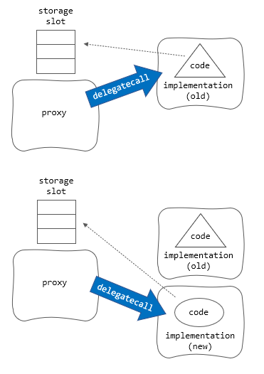

### Upgradeable Contract

스마트 컨트랙트는 한번 배포되면 수정할 수 없습니다. 그래서 "업그레이드 가능한(Upgradeable)"의 의미는 
컨트랙트의 코드를 변경한다는 의미가 아니라 컨트랙트를 교체한다는 의미입니다. 

업그레이드 가능한 컨트랙트의 기본적인 패턴은 "프록시(proxy)" 패턴으로, 변하지 않는 프록시 컨트랙트가 업그레이드 가능한 "로직(또는 구현, implementation) 컨트랙트의 
주소를 저장하고 있기 때문에 이 주소를 변경하면 새로운 로직 컨트랙트를 가리키게 되고 변경된 코드를 실행할 수 있게 됩니다. 

프록시 컨트랙트는 자신에게 없는 함수를 포워딩하는 `fallback` 함수에서 `delegatecall` 통해 로직 컨트랙트의 함수를 호출합니다. 
`delegatecall`은 호출된 컨트랙트의 함수, 즉 로직 컨트랙트의 함수가 실행되지만 상태변수가 저장된 스토리지는 호출한 컨트랙트의 것을 
사용하므로 로직 컨트랙트가 교체되더라도 상태 값들을 그대로 유지할 수 있습니다.



업그레이드 컨트랙트에서 가장 중요한 문제는 프록시 컨트랙트와 로직 컨트랙트의 스토리지 레이아웃을 일관성있게 유지하는 일입니다.
왜냐하면 스토리지 레이아웃이 달라지거나 타입이 변경되면 저장된 상태변수가 사라지거나 엉뚱한 값이 될 수 있기 때문입니다.
또 프록시 컨트랙트에서 관리자 권한을 제어하여 프록시가 가리키는 로직 컨트랙트의 주소를 아무나 변경할 수 없도록 해야 합니다.

업그레이드 컨트랙트는 스토리지 레이아웃을 담당하는 컨트랙트를 프록시와 로직 컨트랙트가 상속받아서 서로의 레이아웃을 공유하거나 미리 정해진 
슬롯에 값을 저장하여 서로 겹치지 않게 하는 방법을 사용합니다. 이것과 관련된 표준이 바로 [ERC-1967](https://eips.ethereum.org/EIPS/eip-1967)입니다. 

예를 들어 로직 컨트랙트의 주소는 아래와 같은 슬롯번호에 저장합니다.

```
Storage slot 0x360894a13ba1a3210667c828492db98dca3e2076cc3735a920a3ca505d382bbc 
(obtained as bytes32(uint256(keccak256('eip1967.proxy.implementation')) - 1)).
```

업그레이드 메커니즘은 스토리지와 코드를 분리하는 패턴이므로, 배포할 때 로직 컨트랙트에서 실행되는 생성자(`constructor`)는 
의미가 없습니다. 왜냐하면 로직 컨트랙트에서 직접 실행되는 함수들은 자신의 스토리지만 변경할 뿐 프록시에서 보존되는 상태변수들에게는 
영향을 주지 않기 때문입니다. 

따라서 배포 과정 중에 초기화를 담당할 일반 함수 호출이 필요하고 이것은 단 한번만 호출되도록 제약을 두어야 합니다. 오픈제펠린 업그레이드의 디폴트 
초기화 함수는 `initialize`입니다. 대략 다음 형태가 됩니다. 반드시 modifier `initializer`를 주어야 합니다. 

```solidity
function initialize(address anOwner) public virtual initializer {
    _initialize(anOwner);
}
```

오픈제펠린에서 제공되는 업그레이드 컨트랙트에서는 ERC-1967에서 정한 슬롯번호들을 사용합니다. 그리고 UUPS(ERC-1822)에 의해서
업그레이드를 하는 코드(`upgradeTo`, `upgradeToAndCall`)가 로직 컨트랙트에 배치합니다. 이 함수들은 권한을 가진 계정만이 
실행할 수 있어야 하므로 권한 검사가 반드시 선행되어야 합니다. 이를 위해 `UUPSUpgradeable`에 정의된 다음 함수를 상속받아 구현해야 합니다.    

```solidity
function _authorizeUpgrade(address newImplementation) internal virtual;
```

이것을 구현하면 `UUPSUpgradeable`는 다음과 같이 권한을 검사한 후에 업그레이드를 수행합니다.

```solidity
function upgradeTo(address newImplementation) external virtual onlyProxy {
    _authorizeUpgrade(newImplementation);
    _upgradeToAndCallUUPS(newImplementation, new bytes(0), false);
}
```

보안 측면에서 `onlyProxy`를 적용되어 업그레이드가 반드시 프록시를 통해서 실행되는 것을 보장합니다.


